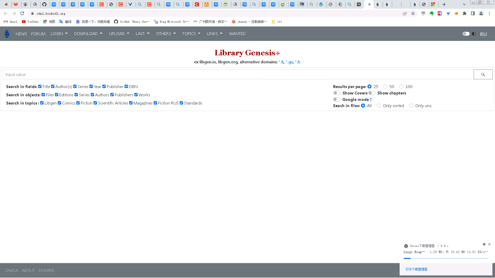
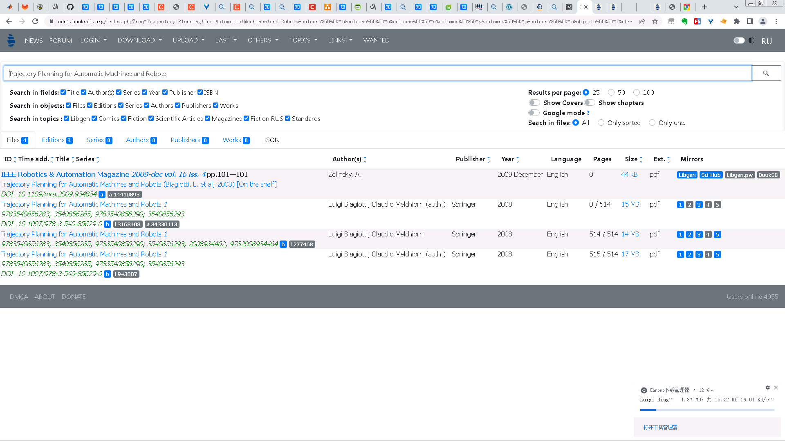
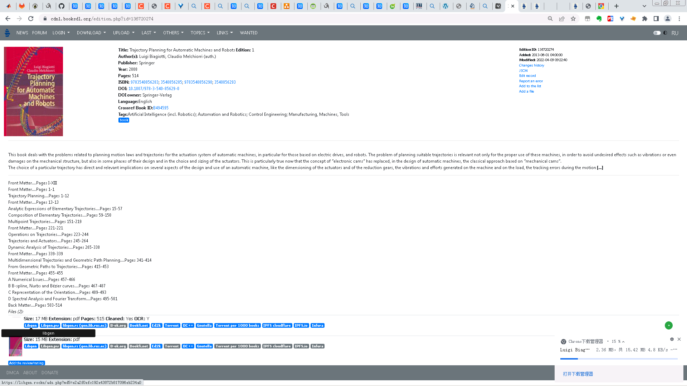
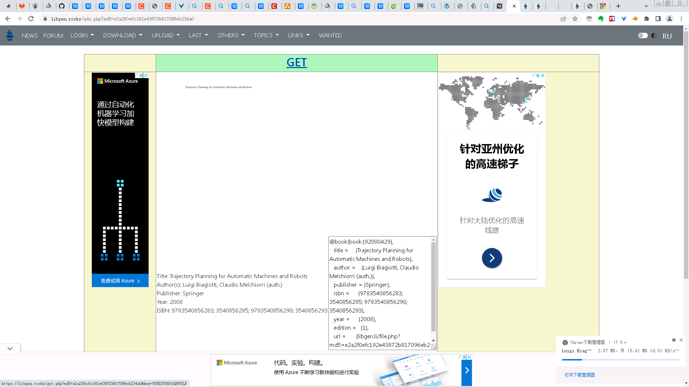

# libgen 使用记录


### 镜像页面

[Libgen - 文献书籍免费下载（由SciHub Pro收集）](https://www.ooopn.com/tool/libgen/)

>  本站实时自动检测并更新 Library Genesis 镜像的可用网址链接，由于网络及国家（学校）的限制，不一定所有网址都能在您所在的位置访问。通常情况下，一半以上是有效的。 SciHub Pro: 科研分享，知识无界， 让我们一起消除科学的障碍。

> 本页面收集Library Genesis镜像的新替代域名，本页面长期有效，每1小时刷新一次，如对您有所帮助，请收藏并推荐给需要的朋友。


### 主页



### 搜索页面



### 书籍详细信息



可以看到，提供多个下载源地址，如magnet, ed2k等等。

### 源




### 下载链接 

[https://cdn1.booksdl.org/get.php?md5=b101902a56040333520ac5e4eb8b2f2b&key=EH7EVYEDWH4NVE59](https://cdn1.booksdl.org/get.php?md5=b101902a56040333520ac5e4eb8b2f2b&key=EH7EVYEDWH4NVE59)


下载得到pdf

## misc


[数值分析](https://libgen.rocks/ads.php?md5=0cc89d10a05aab6a66002a87de26261e)

```
Title: 数值分析
Series: 图灵数学·统计学丛书
Author(s): 索尔(Timothy Sauer)
Publisher: 人民邮电出版社
Year: 2010
ISBN: 9787115217592; 7115217599
```


[Numerical Analysis](https://libgen.rocks/ads.php?md5=f3e0057a9893be05137de4d43e33e189)
```
	Title: Numerical Analysis
Series:
Author(s): Timothy Sauer
Publisher: Pearson
Year: 2017
ISBN: 9780134696454; 013469645X
```