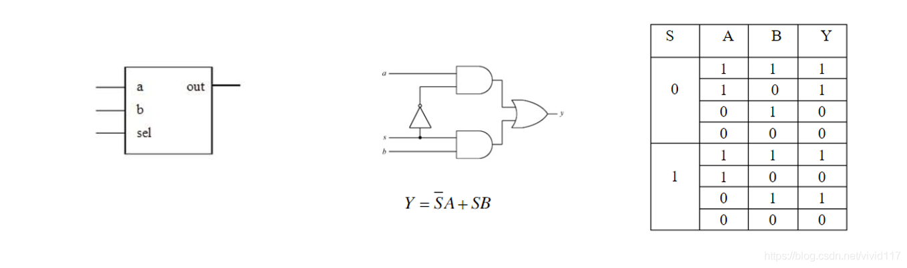
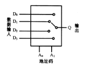
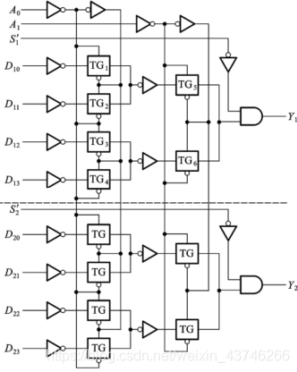

# 总线，选择器

#### Demultiplex 

multiplexer，MUX  多路转换器，多路复用器将来自若干单独分信道的独立信号复合起来，在一公共信道的同一方向上进行传输的设备。
demultiplexer，deMUX  解复用，多路输出选择器恢复复用信号中的合成信号，并将这些信号在各自独立的信道中还原的设备。

Definition - What does Demultiplex (DEMUX) mean? Demultiplex (DEMUX) is the reverse of the multiplex (MUX) process – combining multiple unrelated analog or digital signal streams into one signal over a single shared medium, such as a single conductor of copper wire or fiber optic cable.

问题，众所周知，牛奶和水混合很容易，分离却很困难，那么demux是靠什么实现的？

#### switch 
切换器，虽然右多条通路，单任意时刻都只有一条通路成立。

#### selector 
数据选择器的工作原理：数据选择器就是在数字信号的传输过程中，从一组数据中选出某一个来送到输出端，也叫多路开关

#### 二选一数据选择器（2-1 MUX）

##### 

二选一的数据选择器是最简单的结构，其逻辑框图、门级电路、以及真值表如下：

#### 双四选一数据选择器

以双四选一数据选择器进行说明，内部电路如下图

#### double switch

入口切换器，缓冲区，出口切换器，正好一进一出，构成地址选择

#### bus

总线按功能和规范可分为五大类型：数据总线、地址总线、控制总线、扩展总线及局部总线。

数据总线、地址总线和控制总线也统称为系统总线，即通常意义上所说的总线。常见的数据总线为ISA、EISA、VESA、PCI等。

地址总线：是专门用来传送地址的，由于地址只能从CPU传向外部存储器或I/O端口，所以地址总线总是单向三态的，这与数据总线不同，地址总线的位数决定了CPU可直接寻址的内存空间大小。

控制总线：用来传送控制信号和时序信号。控制信号中，有的是微处理器送往存储器和I/O接口电路的；也有是其它部件反馈给CPU的，比如：中断申请信号、复位信号、总线请求信号、设备就绪信号等。

2、按照传输数据的方式划分，可以分为串行总线和并行总线。串行总线中，二进制数据逐位通过一根数据线发送到目的器件；并行总线的数据线通常超过2根。常见的串行总线有SPI、I2C、USB及RS232等。

3、按照时钟信号是否独立，可以分为同步总线和异步总线。同步总线的时钟信号独立于数据，而异步总线的时钟信号是从数据中提取出来的。SPI、I2C是同步串行总线，RS232采用异步串行总线。

4、微机中总线一般有内部总线、系统总线和外部总线。内部总线是微机内部各外围芯片与处理器之间的总线，用于芯片一级的互连；而系统总线是微机中各插件板与系统板之间的总线，用于插件板一级的互连；外部总线则是微机和外部设备之间的总线，微机作为一种设备，通过该总线和其他设备进行信息与数据交换，它用于设备一级的互连。

那么多分类，笔者也只能选择一种介绍了，就选择内部总线、系统总线和外部总线咯。

#### 扇入（fan-in）和扇出（fan-out）

The number of circuits that can be fed input signals from an output device.
 扇出，可以从输出设备馈送输入信号的电路数量。

扇出（fan-out）是定义单个逻辑门能够驱动的数字信号输入最大量的术语。大多数TTL逻辑门能够为10个其他数字门或驱动器提供信号。因而，一个典型的TTL逻辑门有10个扇出信号。

#### 什么是扇入和扇出？

什么是扇入和扇出？  
在软件设计中，扇入和扇出的概念是指应用程序模块之间的层次调用情况。 

按照结构化设计方法，一个应用程序是由多个功能相对独立的模块所组成。 

扇入：是指直接调用该模块的上级模块的个数。扇入大表示模块的复用程序高。 
扇出：是指该模块直接调用的下级模块的个数。扇出大表示模块的复杂度高，需要控制和协调过多的下级模块；但扇出过小（例如总是1）也不好。扇出过 大一般是因为缺乏中间层次，应该适当增加中间层次的模块。扇出太小时可以把下级模块进一步分解成若干个子功能模块，或者合并到它的上级模块中去。 

设计良好的软件结构，通常顶层扇出比较大，中间扇出小，底层模块则有大扇入。 

其他回答 　 扇入：一个门的输入定义为门的输入的数目。 
扇出：用于描述驱动能力的一个词 
更加恰当的说法是：描述负载状况的一种描述方式