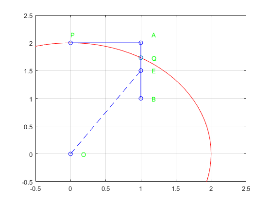

# 中点画圆算法


## 思路与实例

以P点为起点，原点为圆心，绘制半径为2的圆。

这里只考虑第一象限，横坐标小于纵坐标的部分，即1/8圆弧。

在这个区域，斜率的绝对值小于1，即x每次走的比y快。x每次走一步，y至多走一步。x是主轴，y是辅轴。

显然，真实圆弧穿过AB之间的Q点，下一个绘画点是A或B。




### 落点判断
这里需要判断落点是A点，还是B点。

显然，最朴素的想法是比较AQ和BQ的大小，选择距离较近的点。

另一种思路是，引入AB的中点E。计算OE的距离，和半径比较，判断E是否在圆内。

显然有 AO>R, BO < R, OQ = R。

- E在圆内，显然yQ>yE, 则Q点在AE侧，选择A作为目标点
- E在圆外，显然yE>yQ, 则Q点在BE侧，选择B作为目标点

所以，每次判断中点就可以逐点绘制圆弧了。


### 代码
``` matlab
R = 2
x=0;
y=R;
xy = [];
while(x<=y)
    xy=[xy;[x,y]];
    e = (x+1)^2+(y-0.5)^2-R*R
    if e>=0
       x = x+1;
       y = y-1;
    else
       x=x+1;
       y=y;
    end
end
```

### 改进

上面式子中，x和y是逐步更新的，而e的表达式中每次都重新计算平方和，可以考虑优化成逐步更新形式。


$$
e_0 = (x_0+1)^2+(y_0-0.5)^2-R^2 \\
$$

$$
x_1 = x_0+dx \\
y_1 = y_0+dy
$$

计算e的递推式：
$$
e_1 = (x_1+1)^2+(y_1-0.5)^2-R^2 \\
e_1 = (x_0+dx+1)^2+(y_0+dy-0.5)^2-R^2 \\
e_1 = 2dx(x_0+1)+2dy(y_0-0.5)+dx^2+dy^2+e_0 \\
$$

已知dx和dy的值：
$$
dx = 1,dy=0,-1 \\
$$

可以得到更新值：
$$
e_1-e_0= 2x_0+2y_0*dy+3
$$
### 8倍圆绘制

上面的方法只考虑第一象限，横坐标小于纵坐标的部分，即1/8圆。

考虑使用对称的方法，画完整的圆。

对于(x,y)点

1. 原点(x,y)
2. 使用横坐标对称 (x,-y)
3. 使用纵坐标对称(-x,y)
4. 使用中心对称 (-x,-y)
5. 使用xy对称，得到横坐标大于纵坐标的部分圆弧(y,x)
6. xy对称+横坐标对称 (-y,x)
7. xy对称+纵坐标对称 (y,-x)
8. xy对称+中心对称 (-y,-x)

综合使用以上的对称方法，可以得到八个点。

### 完整代码
完整的源码如下：

``` matlab
R = 33
%%
x=0;
y=R;
xy = [];
% e = (x+1)^2 + (y-0.5)^2-R^2;
e = x*x+y*y-R*R +2*x-y+5/4;
while(x<=y)
    xy=[xy;[x,y;y,x;y,-x;x,-y;-x,-y;-y,-x;-y,x;-x,y]];
    if e>=0
        dx = 1;
        dy = -1;
    else
        dx = 1;
        dy = 0;
    end
    % e = e+ dx^2+2*dx+dy^2+2*dy+2*dx-dy;
    e = e + 2*x+3+2*y*dy;
    x = x+dx;
    y = y+dy;
end

%%
nseg = 100;
theta = 0 : (2 * pi / nseg) : (2 * pi);
pline_x = R * cos(theta);
pline_y = R * sin(theta);
%%
figure;
plot(pline_x,pline_y,'r-');hold on;
plot(xy(:,1),xy(:,2),'o');
```

