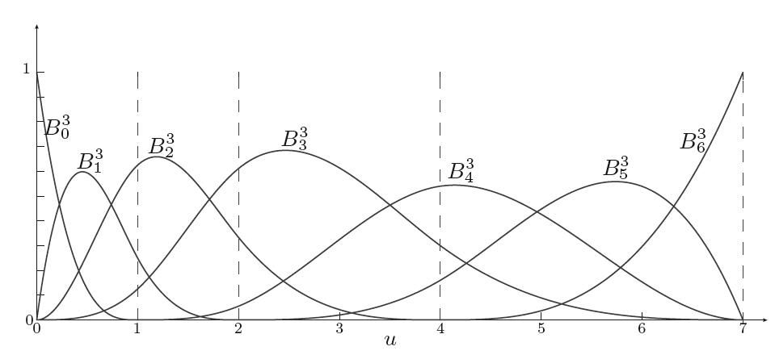

# BSpine

- BSpine
- NURBS

- 三次样条：非均匀 三次样条。
- 均匀B样条：结点都是简单节点并且间隔相等。
- 准均匀型B样条：首尾节点是多重节点，其他都是简单节点。
- 贝塞尔曲线：非均匀 波恩斯坦多项式
- 非均匀B样条 NUBS
- 非均匀有理B样条(Non-Uniform Rational B-Splines, NURBS)

样条函数具有局部支撑特性；波恩斯坦多项式是全局支撑特性，所以贝塞尔曲线不是样条。

#### BSpine
b样条默认是非均匀采样。

b样条基函数
- 0阶函数  常数
- 1阶函数

支持升阶操作。
样条函数特点：
- 连续，光滑
- 在区间外的值为0（紧支撑），端点（除去首尾端点）值为0。

#### knots
nonuniform knot vector

$$
u = [u_{min},...u_{min}, u_{p+1}, ...,u_{max},...,u_{max}]
$$

$$
s(u)=\sum_{j=0}^m{p_jB_j^p(u)}
$$

节点向量 [u_0,u_1,...u_n]
每页节点都有重复度
简单节点：重复度为1。
多重节点：重复度大于1。

u 的含义和贝塞尔曲线的t的意义相似。

重复度有什么深刻含义？ 

### 基函数
基函数局部支撑性

#### figure
三次基函数：u = [0, 0, 0, 0, 1, 2, 4, 7, 7, 7, 7].

分段区间：
- [0，1]
- [0，2]
- [0，4]
- [0，7]
- [1，7]
- [2，7]
- [4，7]

> The difference between knots and breakpoints is that breakpoints are the set of distinct knot values.
断点和结点的区别，结点可以重复，断点不能。

degree

#### Conversion from B-form to Piecewise Polynomial form(pp-form)

#### NURBS

$$
n(u)=\frac{\sum_{j=0}^m{p_jw_jB_j^p(u)}}{\sum_{j=0}^m{w_jB_j^p(u)}}
$$

$$
n(u)=\sum_{j=0}^m{p_jN_j^p(u)}
$$

$$
N_j^p(u)=\frac{w_jB_j^p(u)}{\sum_{j=0}^m{w_jB_j^p(u)}}
$$

非均匀有理B样条曲线有以下4个特点：
（1）B样条曲线的所有优点都在非均匀有理B样条曲线中保留。
（2）透视不变性。控制点经过透视变换后所生成的曲线或曲面与原先生成的曲线或曲面的再变换是等价的。
（3）球面等二次曲面的精确表示。其他B样条方法只能近似地表示球面等形状，而NURB不仅可表示自由曲线和曲面，还可以精确地表示球面等形状。
（4）更多的形状控制自由度。NURB给出更多的控制形状的自由度可用来生成各种形状。

如果所有权重均等于1，则NURBS曲线将退化为B样条曲线。

### t spline