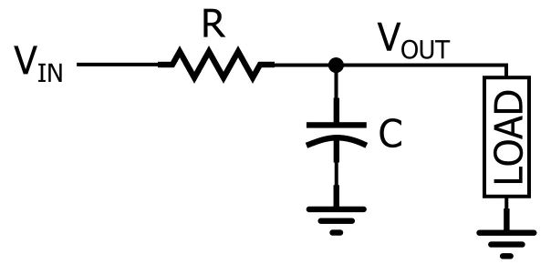

# RC滤波器

在数据采集领域，RC滤波器是最常见的信号调理电路，包括RC低通滤波器，RC高通滤波器。

## lowpass RC filter

一阶惯性滤波，最常见的是RC低通电路

如图所示，通过将一个电阻与信号路径串联，并将一个电容与负载并联，可以产生RC低通响应。在图中，负载是单个组件.

设$T=RC$。

以电容作为输出电压u_o，则有以下方程.

#### 时域

时域：
$$
I_c=C\frac{dU_c}{dt}\\
U_i=RI_c+U_c
$$

#### 时域解

时域通解：
$$
U_c(t)=U_i(1-e^{-t/RC})
$$
稳态值为U_i，达到稳态的时间约为：
$$
t_s=5RC=5T
$$

#### 频域

频域：
$$
u_i=Ri+u_c\\
u_c=\frac{i}{sC}
$$

可得
$$
u_i=i(R+1/sC)\\
i= \frac{sCu_i}{1+sCR}\\
u_c=i/(sC)=\frac{u_i}{1+sCR}\\
\frac{u_c}{u_i}=\frac{1}{1+sCR}
$$

令$T=RC$，有
$$
\frac{u_c}{u_i}=\frac{1}{1+Ts}
$$
显然这是一阶系统中，最常见的惯性滤波。

#### 直流分析

显然，直流增益为1. 相移是0度。

#### 截止频率分析

截止频率分析

截止频率fC计算如下
$$
10log_{10}(T(jω)|_{w=1/T})=10lg(1/2)=-3 dB
$$
3dB对应的截止频率是$ω_c= 1/RC=1/T$
$$
T(jω=jω_c)=\frac{1}{1+jTω_c}=\frac{1}{1+j}\\
=\frac{1-j}{2}\\
\theta=atan(\frac{-1}{1})=-\pi/4
$$

截止频率处，相移是-45度。

#### 高频分析

高频分析：
$$
T(jω=j\infty)=\frac{1}{1+jTω}=\frac{1-jTω}{1+T^2ω^2}\\
\theta=atan(\frac{-Tω}{1})=-\pi/2
$$
可知其对于高频的响应为幅值趋向于0，相位趋向于负九十度。

#### 波特图

波特图略

#### 数字化的实现

采用后向差分法/双线性变换，将s域转换为z域

$$
Y(n)=αX(n) + (1-α)Y(n-1) 
$$

## highpass RC filter

以电阻作为输出电压uo，则有
$$
\frac{u_r}{u_i}=\frac{sCR}{sCR+1}\\
=1-\frac{1}{sCR+1}\\
$$

