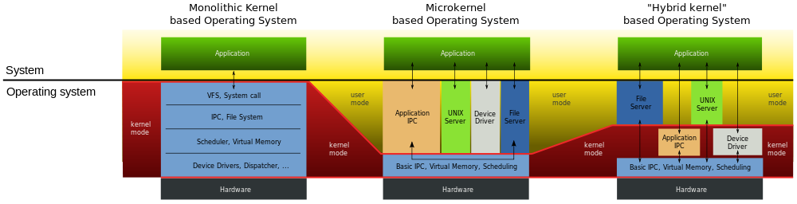
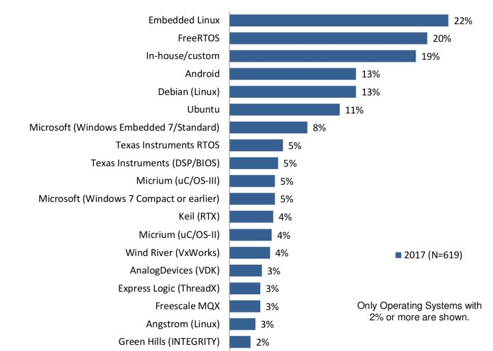

# [宏内核、微内核和混合内核](https://www.cnblogs.com/feng9exe/p/12420962.html)

## overview

操作系统主要承担以下功能：
* 内存管理 （虚拟内存？）
* CPU调度 （上下文切换？）
* 文件系统
* 进程间通信 IPC
* 网络IO （中断处理？）
* 硬件驱动
* 桌面系统（非必需项）
* shell

## Monolithic Kernel

无论是Windows还是Linux等等，这些寻常使用的操作系统，都是用内核和管理和使用硬件的。

宏内核。

Monolithic，词典义是『单一的，庞大的』，简单理解，就是内核的所有功能，从文件系统，到内存管理，到CPU调度，等等等等，都放在内核态中。这样做有一个很大的好处，那就是所有这些功能都在同一个地址空间下，大家做通信会非常方便，而且通信的成本肯定也是低的，实现起来会快糙猛一些。就是很莽很厉害。

但是，这样也会导致一些其他问题。我觉得最大的问题就是代码复杂度会提高。Linux Kernel的代码量太美不看。同时，这样也会导致容错性不是很好，只要一个地方出了问题，会导致整个Kernel都挂掉。

操作系统有：Linux，Windows 9X 系列 ， MacOS 8.6 版本之前
## Micro Kernel

那既然Monolithic Kernel有这样的问题，做研究的人一定不会放过这样的好机会，于是就有了微内核的概念。所谓微内核，是指内核只提供最必要的功能，比如IPC，内存管理，CPU调度等等。而其他，诸如文件系统，网络IO等等，都放在用户态来实现。

这样做的好处首先是内核变小了，内核是常驻内存的，小了自然就节约了内存的空间。但是，这样的性能就会不如很莽很厉害的Monolithic Kernel要好，因为IPC通信的overhead还是有一些的。

微内核系统有：Fuchsia，Minix，QNX

## Hybrid Kernel

那既然Micro Kernel和Monolithic Kernel都有问题，能不能把两个结合一下，互相中和呢。

PPAP (Kernel Version)
I have a Monolithic Kernel.
I have a Micro Kernel.
Bow!
Hybrid Kernel!

这大概是研究的惯用套路，一个事情有两种极端的做法，然后中和一下，就有了第三种做法。那Hybrid Kernel就是把一部分不常使用的内核模块，或者是原本需要的时间就很长，因此IPC的overhead看起来就不是那么夸张的功能，移出内核，而其他的就会放在内核里。

 

之前说到的Monolithic Kernel也好，Micro Kernel也好，它们对资源的保护和管理都是在内核里去做的，也就是说，它们都是先对硬件做抽象，然后向上不直接暴露硬件，而是暴露硬件的抽象。一个例子，硬盘是硬件设备，但是我们的应用程序看到的是一个个的文件，文件本身就是一种抽象。而应用程序，是没办法直接操作硬件的，只能跟操作系统提供的抽象打交道。

混合内核实质上是微内核，只不过它让一些微核结构运行在用户空间的代码运行在内核空间，这样让内核的运行效率更高些。这是一种妥协做法，设计者参考了微内核结构的系统运行速度不佳的理论。
然而后来的实验证明，纯微内核的系统实际上也可以是高效率的。大多数现代操作系统遵循这种设计范畴，微软视窗就是一个很好的例子。另外还有XNU，运行在苹果Mac OS X上的内核，也是一个混合内核

## 外内核

外内核是把硬件暴露给应用程序，应用程序可以直接访问硬件，外内核对系统提供保护。目前还在研究阶段。
## misc
一图查看区别

### 其他OS
QNX、WinCE、Linux三大底层车机操作系统
MQX、FreeRTOS以及ucOS

freertos和ucos主要叫实时操作系统系统，优点在于实时。他们的调度性比较好。而我们常见的windows和Linux是基于公平性原则调度。

 ###  UCOS 
 UCOS 是一个可以基于ROM运行的、可裁减的、抢占式、实时多任务内核，具有高度可移植性的嵌入式实时操作系统。特别适合于微处理器和控制器，适合很多商业操作系统。有着完整的网络系统和文件系统，并且开放源代码。功能支持TCP/IP、USB、CAN总线、Modbus。具有一个强大的文件系统和图形用户界面。UCOS采用可剥夺型实时多任务内核，其任务调度是完全基于任务优先级的抢占式调度，具有可靠及高效等特点。在建筑工业控制、医疗设备、航天系统等领域有广泛的应用。