# 硬盘接口和连接线

### 硬盘端口

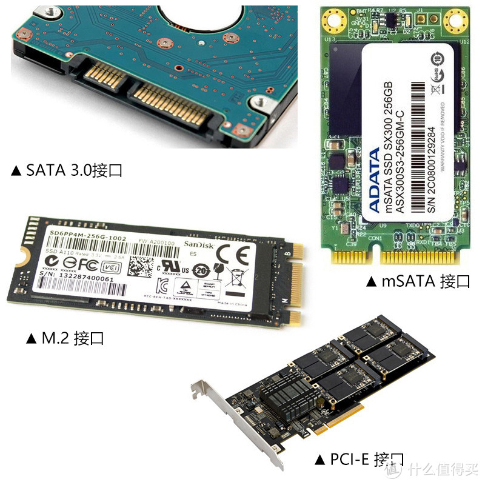

### IDE电源
IDE电源线分红，黑蓝三色（如下图），其针脚定义可以按颜色来区分：
IDE电源线分红，黑蓝三色，其针脚定义可以按颜色来区分： 红色线为5V电源，黑色线为GND，黄色线为12V电源。

IDE电源口：大4pin （母口）

硬盘IDE电源口：大4pin 公口？

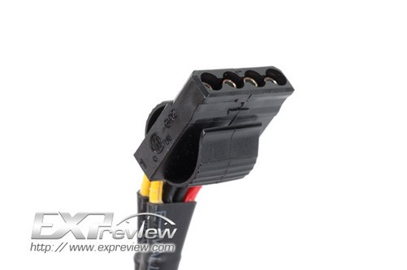

#### sata Power connectors

sata电源接口

硬盘sata电源口：15pin口 （公口） _|

电源sata电源口：15pin口 （母口？）L

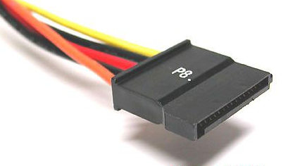

#### sata电源接口和IDE电源接口
sata硬盘线有4线（D型口）和15线两种，15线的实际上就是有15个触点，对外则有5条线。
15线的插头一般是电源自带的插头，有黑线、红线、橙线、黄线，也就是有5v、3.3v、12v三种电压；4线D型插头只有黑、红、黄三色四条线。经解剖，并咨询过主板厂商和硬盘厂商，现在的sata硬盘并不必需要3.3v电源（3.3v电源可以由5v转换过来），所以4线和15线的插头起的作用是一样的，并无优劣之分。但是15线线插头（由D型口转接的）有些产品容易发生接触不良而损伤硬盘的故障，所以要注意检查辨别。直接从电源输出的15线口一般比较保险。

#### sata Data connector

- 硬盘sata信号口：7pin （公口） L
- 主板sata信号口：7pin （公口） L
- sata信号连接线： 7pin 母口转母口 _|

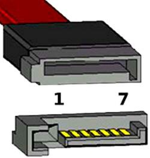
上面是数据线（母口），下方是是硬盘的公口。

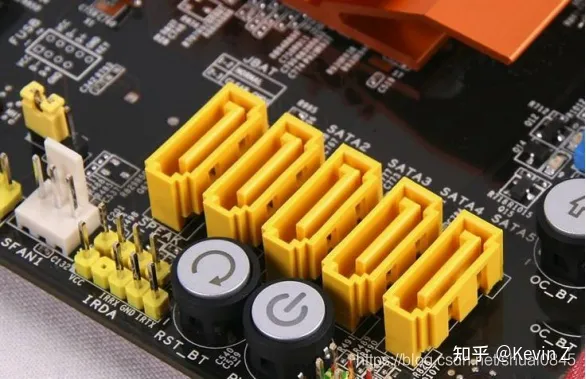

### 转接线
转接线：

#### IDE电源延长线

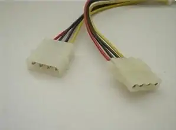

#### IDE转SATA
SATA电源线 台式主机电脑硬盘连接线大4pin转15pin

大4pin(输入）转15pin（输出） （公口转母口）

大4pin转15pin 一分为二 （4pin公口转15pin母口）

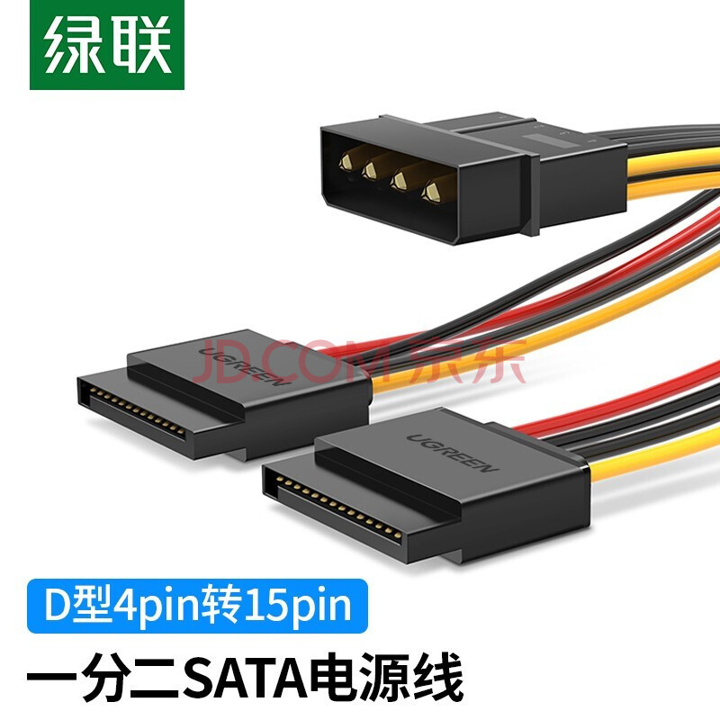

#### SATA转IDE电源线
SATA转IDE电源线，SATA 15P转大4P电源，SATA串口电源转并口IDE， SATA公头输入，IDE母口输出？

适用于SATA口多，IDE口少的情况。

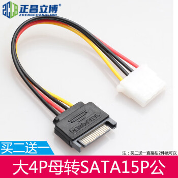

#### sata电源延长线
sata电源一分二 （公口输入，双母口输出）

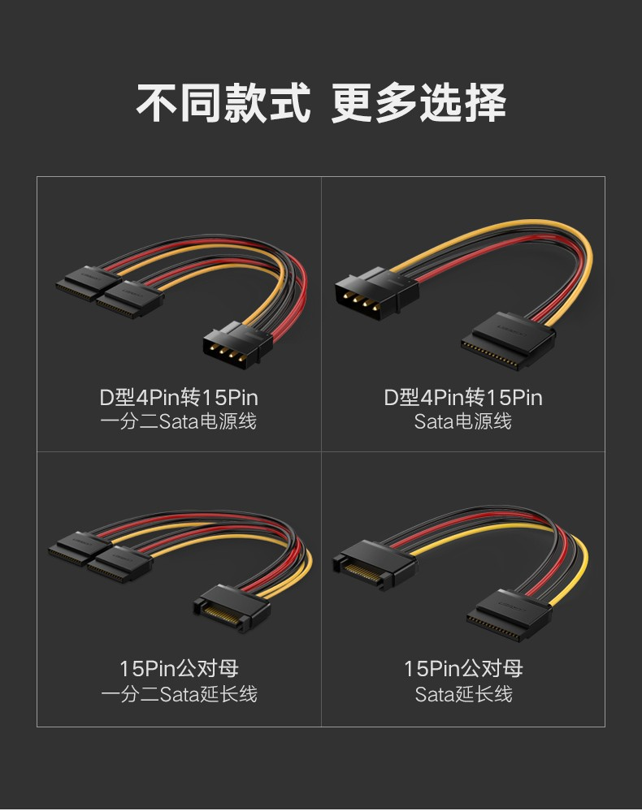
#### sata信号线
sata信号连接线 7pin 母口转母口

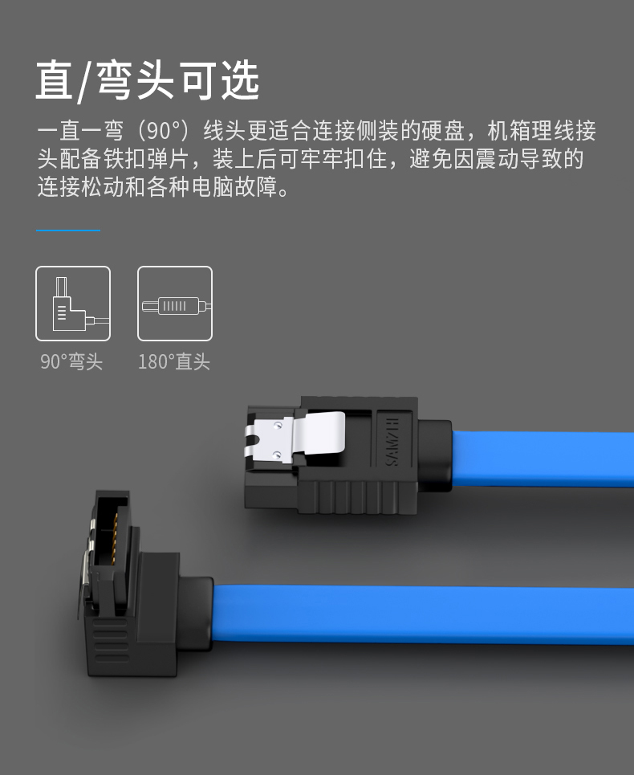
#### SATA信号延长线
SATA延长线缆，7pin  公头/母头.
用于外接硬盘，传输数据.

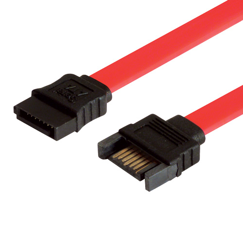

### SATA
SATA全称是SerialAdvanced Technology Attachment（串行高级技术附件，一种基于行业标准的串行硬件驱动器接口），是由Intel、IBM、Dell、APT、Maxtor和Seagate公司共同提出的硬盘接口规范。

### sata3
SATA 1接口的传输速率则为1Gb/s，传输速度150MB/s。

SATA 3传输带宽可以达到6Gb/s，传输速度150MB/s；而SATA 2接口的传输带宽则为3Gb/s，传输速度300MB/s。理论上，SATA 3接口是SATA 2的2倍。

SATA 2和SATA 3主板硬盘接口外观基本相同，不过很多中低端主板中采用SATA 2和SATA 3双接口混合模式，像AMD平台的A75，Intel平台的B75、H81、B85主板均为SATA 2SATA 3双接口混合模式，而一些中高端主板，如A88、H87、Z87等主板则全为SATA 3接口。

### Micro SATA connector
Micro SATA connector
> The micro SATA connector (sometimes called uSATA or μSATA[55]) originated with SATA 2.6, and is intended for 1.8-inch hard disk drives. There is also a micro data connector, similar in appearance but slightly thinner than the standard data connector. 
> 
### mSATA接口
mSATA接口，全称迷你版SATA接口（mini-SATA）。是早期为了更适应于超级本这类超薄设备的使用环境，针对便携设备开发的mSATA接口应运而生。可以把它看作标准SATA接口的mini版，而在物理接口上（也就是接口类型）是跟mini PCI-E接口是一样的。

> Mini-SATA (abbreviated as mSATA), which is distinct from the micro connector,[55] was announced by the Serial ATA International Organization on September 21, 2009.[65] Applications include netbooks, laptops and other devices that require a solid-state drive in a small footprint. 

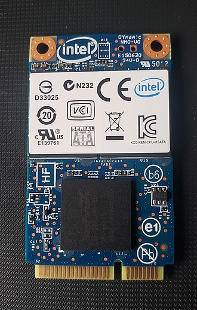
### NGFF
> M.2, formerly known as the Next Generation Form Factor (NGFF), is a specification for computer expansion cards and associated connectors. It replaces the mSATA standard, which uses the PCI Express Mini Card physical layout. Having a smaller and more flexible physical specification, together with more advanced features, the M.2 is more suitable for solid-state storage applications in general, especially when used in small devices such as ultrabooks or tablets.[74] 

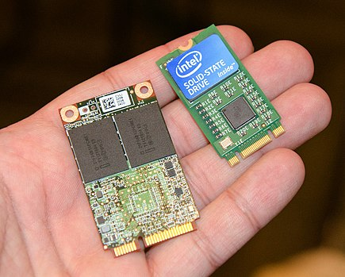

Size comparison of mSATA (left) and M.2 (size 2242, right) SSDs

## misc

### 安装硬盘
台式电脑安装硬盘
1. 用sata数据线连接主板和硬盘7pin口
2. 用sata电源线连接硬盘15pin口
3. 用螺丝固定硬盘

