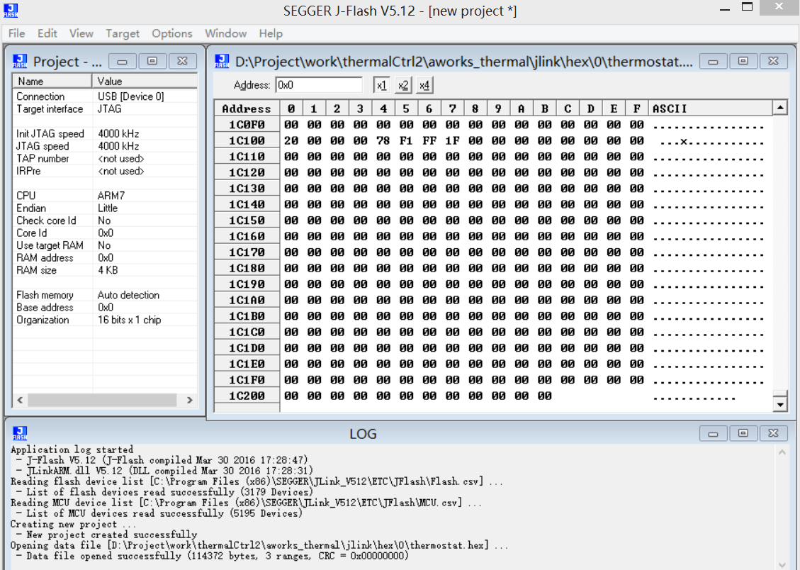

# jlink


## install
下载路径在 `\\192.168.0.8\软件\驱动`，安装jlink软件。

## jlink烧录


1. 连接硬件：串口线转jlink转usb接口，usb口接电脑，串口线连接板子的TTL口
2. 打开JFlash.exe软件，配置工程或导入工程
3. 点击菜单栏的文件菜单，选择Open File选项，打开文件选择对话框，选择bin文件，
4. 连接，program或按F5键。
5. 拔出usb线，断电重启设备。


选中文件 -> 右键 -> 工作模式扩展功能 -> 解密安全涉密文件



### AWORKS配置

1. 拷贝安装eclipse，jre和AWORKS库文件
2. 打开eclipse软件，右键project Explorer，选择import选项。
3. 到达项目路径，搜索导入项目文件，后缀名为cproject


### project


KL16.jflash
``` ini
  AppVersion = 51200
[GENERAL]
  ConnectMode = 0
  CurrentFile = "E:\核心板项目\核心板测试架\测试方案PC主控\固件 2017-12-27 08-41-26\temp_core_test--用于测试架测试-核心板.hex"
  DataFileSAddr = 0x00000000
  GUIMode = 0
  HostName = ""
  TargetIF = 1
  USBPort = 0
  USBSerialNo = 0x00000000
[JTAG]
  IRLen = 0
  MultipleTargets = 0
  NumDevices = 0
  Speed0 = 4000
  Speed1 = 4000
  TAP_Number = 0
  UseAdaptive0 = 0
  UseAdaptive1 = 0
  UseMaxSpeed0 = 1
  UseMaxSpeed1 = 1
[CPU]
  CheckCoreID = 1
  ChipName = "Freescale MKL16Z128xxx4 (allow security)"
  ClockSpeed = 0x00000000
  Core = 0x060000FF
  CoreID = 0x0BC11477
  CoreIDMask = 0x0F000FFF
  DeviceFamily = 0x00000006
  EndianMode = 0
  HasInternalFlash = 1
  InitStep0_Action = "Reset"
  InitStep0_Comment = "Reset and halt target"
  InitStep0_Value0 = 0x00000000
  InitStep0_Value1 = 0x00000000
  NumExitSteps = 0
  NumInitSteps = 1
  RAMAddr = 0x1FFFF000
  RAMSize = 0x00004000
  ScriptFile = ""
  UseAutoSpeed = 0x00000001
  UseRAM = 1
  UseScriptFile = 0
[FLASH]
  aSectorSel[128] = 1,1,1,1,1,1,1,1,1,1,1,1,1,1,1,1,1,1,1,1,1,1,1,1,1,1,1,1,1,1,1,1,1,1,1,1,1,1,1,1,1,1,1,1,1,1,1,1,1,1,1,1,1,1,1,1,1,1,1,1,1,1,1,1,1,1,1,1,1,1,1,1,1,1,1,1,1,1,1,1,1,1,1,1,1,1,1,1,1,1,1,1,1,1,1,1,1,1,1,1,1,1,1,1,1,1,1,1,1,1,1,1,1,1,1,1,1,1,1,1,1,1,1,1,1,1,1,1
  AutoDetect = 0
  BankName = ""
  BankSelMode = 1
  BaseAddr = 0x00000000
  CheckId = 0
  CustomRAMCode = ""
  DeviceName = "MKL16Z128xxx4 internal (allow security)"
  EndBank = 127
  NumBanks = 1
  OrgNumBits = 32
  OrgNumChips = 1
  StartBank = 0
  UseCustomRAMCode = 0
[PRODUCTION]
  AutoPerformsErase = 1
  AutoPerformsHardLock = 0
  AutoPerformsHardUnlock = 0
  AutoPerformsProgram = 1
  AutoPerformsSecure = 0
  AutoPerformsSoftLock = 0
  AutoPerformsSoftUnlock = 1
  AutoPerformsStartApp = 0
  AutoPerformsUnsecure = 0
  AutoPerformsVerify = 1
  EnableProductionMode = 0
  EnableTargetPower = 0
  EraseType = 2
  MonitorVTref = 0
  MonitorVTrefMax = 0x0000157C
  MonitorVTrefMin = 0x000003E8
  OverrideTimeouts = 0
  ProductionDelay = 0x000001F4
  ProductionThreshold = 0x00000BB8
  ProgramSN = 0
  SerialFile = ""
  SNAddr = 0x00000000
  SNInc = 0x00000001
  SNLen = 0x00000008
  SNListFile = ""
  SNValue = 0x00000001
  StartAppType = 0
  TargetPowerDelay = 0x00000014
  TimeoutErase = 0x00003A98
  TimeoutProgram = 0x00002710
  VerifyType = 1
```