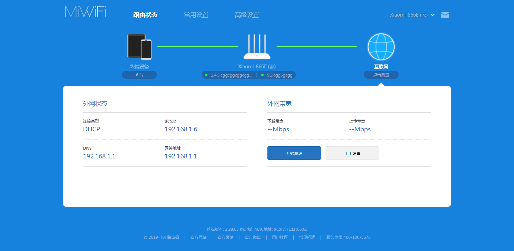
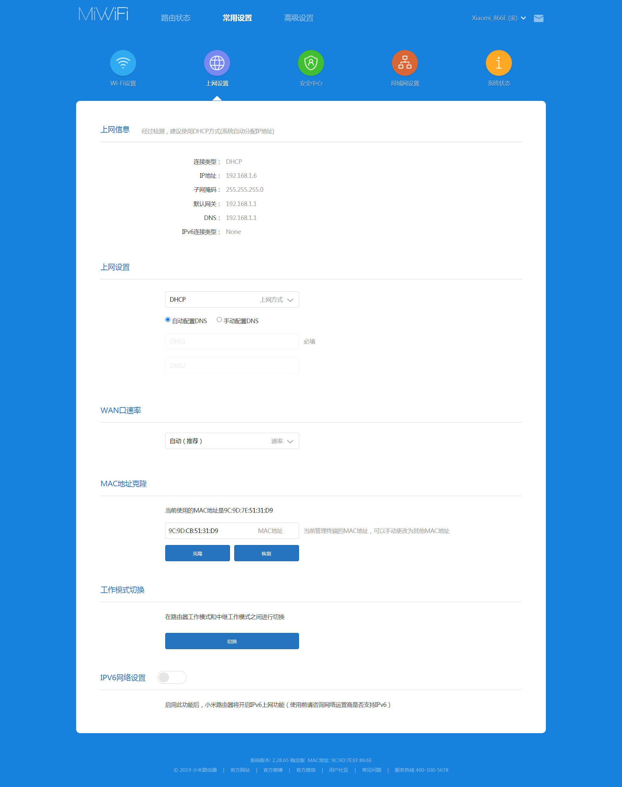
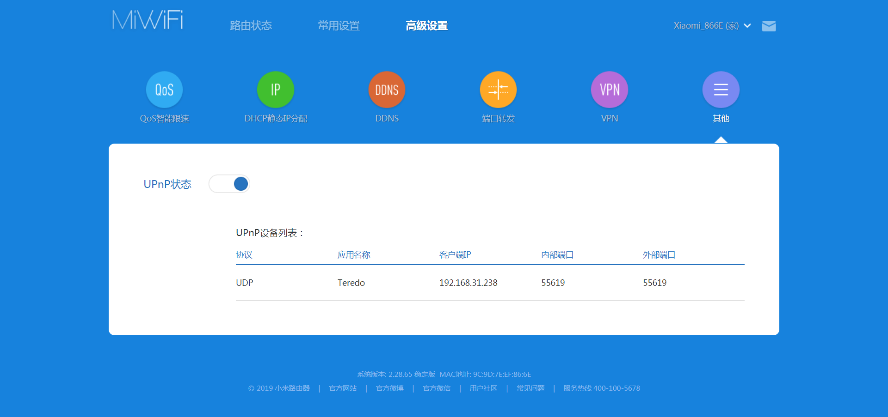

# router

## 状态

## 常用设置

## 高级设置

### DHCP

### QoS

### UPnP状态
通用即插即用（英语：Universal Plug and Play，简称UPnP）是由“通用即插即用论坛”（UPnP™ Forum）推广的一套网络协议。该协议的目标是使家庭网络（数据共享、通信和娱乐）和公司网络中的各种设备能够相互无缝连接，并简化相关网络的实现。UPnP通过定义和发布基于开放、因特网通讯网协议标准的UPnP设备控制协议来实现这一目标。
### port trans
#### port
端口转发
#### dmz
DMZ，是英文“demilitarized zone”的缩写，中文名称为“隔离区”，也称“非军事化区”。它是为了解决安装防火墙后外部网络的访问用户不能访问内部网络服务器的问题，而设立的一个非安全系统与安全系统之间的缓冲区。该缓冲区位于企业内部网络和外部网络之间的小网络区域内。在这个小网络区域内可以放置一些必须公开的服务器设施，如企业Web服务器、FTP服务器和论坛等。另一方面，通过这样一个DMZ区域，更加有效地保护了内部网络。因为这种网络部署，比起一般的防火墙方案，对来自外网的攻击者来说又多了一道关卡。

开启DMZ功能可以将内网某一个设备的IP映射到外网，方便从外网访问到该设备。

### VPN
#### L2TP

#### PPTP

## misc

#### AP隔离

AP隔离是一种路由模式。 AP隔离指的是开启之后，各个连接的设备不能互相通讯，起到隔离的作用，来保障不同用户的安全。 多见于无线通信方面，常见于 路由器 设置中。 AP隔离非常类似有线网络的VLAN（ 虚拟局域网 ），将所有的无线客户端设备之间完全隔离，使客户端只能访问AP接入的固定网络。 该措施非常适合大型的会议室、酒店、机场等公共场所的无线网络建设，让各个接入的无线客户端之间相互保持隔离，提供彼此间更加安全的接入。