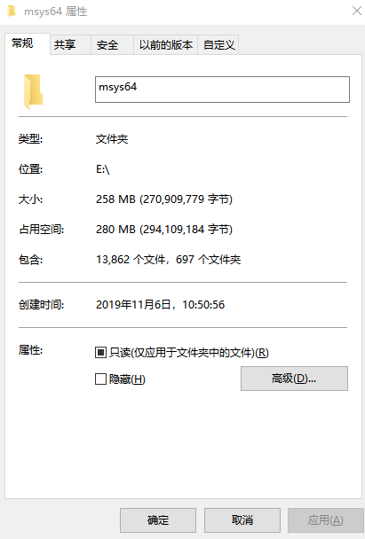

# msys2

[TOC]


## install
windows系统下下载msys2-x86_64-20180531.exe（80MB），双击选择安装路径。

安装后258MB




### msys2

msys2的软件版本分为mingw32,mingw64和msys三种环境。

以上三种环境可以通过一个脚本分别实现

``` bash
C:\msys64\msys2_shell.cmd -msys
C:\msys64\msys2_shell.cmd -mingw64
C:\msys64\msys2_shell.cmd -mingw32
```

**Q**: 三种环境有何区别？

**A**:？？？

### dir

autorebase.bat 可以在cmd中快速实现msys环境。

``` bash
maintenancetool.exe  mingw32.exe  mingw64.exe  msys2.exe autorebase.bat msys2_shell.cmd # 可执行程序
home ,usr ,var ,tmp ,etc ,dev ,mingw32 ,mingw64 #  msys根目录，可以快速直达
# mingw32 &mingw64 为空文件夹


```


### 相关软件

以下概念容易混淆：mingw，mingw-w64， msys,msys2,cygwin.

​	**mingw**包含C运行库和windows的头文件，以及编译链工具，可以生成windows的32位可执行文件。通过提供对等于	windowsSDK的头文件和库文件，可以开发原生的windows应用。
​	**Mingw-w64**是Mingw衍生而来，可以生成32位和64位的windows可执行文件。
​	**msys**是包含Mingw的集成环境，提供了命令行工具。
​	**msys2**是集成环境，从cygwin中fork而来，实现了仿gnu编译环境，提供了pacman作为包管理工具。
​	**cygwin**是中间层，在window下模拟实现了unix的类函数。linux下写的代码（支持POSIX API)可以无需修改，移植到windows下环境。 

cygwin和MinGW主要核心区别在于：MinGW只支持C/C++标准库，cygwin还支持POSIX API， MinGW生成windows的原生程序，cygwin生成程序非原生，cygwin生成程的运行速度较mingw生成程序的运行速度慢。

POSIX API 包括pthreads的线程库。

## tools

以下是常用工具，包括pacman，zsh，gcc。

#### pacman

```bash
pacman -Sy  # update
pacman -Syu # update all
pacman -Ss xxx # search xxx
pacman -Sy xxx # install xxx
pacman -Sl # 查看软件清单
pacman -Sl |grep "gcc"

pacman -S make yasm diffutils pkg-config
```

```
admin@DESKTOP-CTAGE42 MSYS ~
$ pacman -S make yasm diffutils pkg-config
警告：make-4.2.1-1 已经为最新 -- 重新安装
正在解决依赖关系...
正在查找软件包冲突...

软件包 (4) diffutils-3.6-1  make-4.2.1-1  pkg-config-0.29.2-1  yasm-1.3.0-2

下载大小:   0.81 MiB
全部安装大小：  4.87 MiB
净更新大小：  3.65 MiB

:: 进行安装吗？ [Y/n] y
:: 正在获取软件包......
 yasm-1.3.0-2-x86_64      308.7 KiB   267K/s 00:01 [#####################] 100%
 diffutils-3.6-1-x86_64   329.9 KiB   153K/s 00:02 [#####################] 100%
 pkg-config-0.29.2-1...   185.7 KiB   226K/s 00:01 [#####################] 100%
(4/4) 正在检查密钥环里的密钥                       [#####################] 100%
(4/4) 正在检查软件包完整性                         [#####################] 100%
(4/4) 正在加载软件包文件                           [#####################] 100%
(4/4) 正在检查文件冲突                             [#####################] 100%
(4/4) 正在检查可用硬盘空间                         [#####################] 100%
:: 正在处理软件包的变化...
(1/4) 正在重新安装 make                            [#####################] 100%
(2/4) 正在安装 yasm                                [#####################] 100%
(3/4) 正在安装 diffutils                           [#####################] 100%
(4/4) 正在安装 pkg-config                          [#####################] 100%
```

pacman配置颜色

### zsh

### gcc


## misc

### project


rdrand.asm
#### msvc

```
nmake /f cryptest.nmake
```
#### test

```
PS D:\AlBrowserDownloads\cryptopp600> cmd
Microsoft Windows [版本 10.0.17134.648]
(c) 2018 Microsoft Corporation。保留所有权利。
D:\AlBrowserDownloads\cryptopp600>cryptest.exe
Test Driver for Crypto++(R) Library, a C++ Class Library of Cryptographic Schemes
- To generate an RSA key
        cryptest g
- To encrypt and decrypt a string using RSA
        cryptest r
- To sign a file using RSA
        cryptest rs privatekeyfile messagefile signaturefile
- To verify a signature of a file using RSA
        cryptest rv publickeyfile messagefile signaturefile
- To digest a file using several hash functions in parallel
        cryptest m file
- To encrypt and decrypt a string using DES-EDE in CBC mode
        cryptest t
- To encrypt or decrypt a file
        cryptest e|d input output
- To secret share a file (shares will be named file.000, file.001, etc)
        cryptest ss threshold number-of-shares file
- To reconstruct a secret-shared file
        cryptest sr file share1 share2 [....]
        (number of shares given must be equal to threshold)
- To information disperse a file (shares will be named file.000, file.001, etc)
        cryptest id threshold number-of-shares file
- To reconstruct an information-dispersed file
        cryptest ir file share1 share2 [....]
        (number of shares given must be equal to threshold)
- To gzip a file
        cryptest z compression-level input output
- To gunzip a file
        cryptest u input output
- To encrypt a file with AES in CTR mode
        cryptest ae input output
- To base64 encode a file
        cryptest e64 input output
- To base64 decode a file
        cryptest d64 input output
- To hex encode a file
        cryptest e16 input output
- To hex decode a file
        cryptest d16 input output
- To forward a TCP connection
        cryptest ft source-port destination-host destination-port
- To run the FIPS 140-2 sample application
        cryptest fips
- To generate 100000 random files using FIPS Approved X.917 RNG
        cryptest fips-rand
- To run Maurer's randomness test on a file
        cryptest mt input
- To run a test script (available in TestVectors subdirectory)
        cryptest tv filename
- To run validation tests
        cryptest v
- To display version number
       cryptest V
- To run benchmarks
        cryptest b [time allocated for each benchmark in seconds] [frequency of CPU in gigahertz]
D:\AlBrowserDownloads\cryptopp600>cryptest.exe g
Key length in bits: 1024
Save private key to file: abc
Save public key to file: abcPub
Random Seed: ssdfsdfs
```


