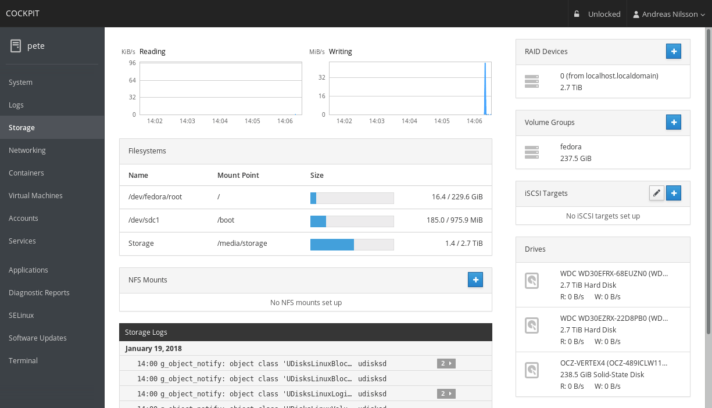

# Cockpit

官方网站：https://cockpit-project.org/。

Cockpit是一个Web端的系统管理工具，只用鼠标点点就能管理系统，事实上也确实如此，启动Cockpit服务之后，只需要鼠标点点点就能完成系统很多基础操作，比如查看系统信息，启动/停止服务，新增或者更改账户，系统更新，Web终端及查看网络流量等功能。


Cockpit ScreenShot

安装
某些发行版本已经默认安装，只需执行命令开机启动和添加防火墙就好。

如果系统中没有默认安装，执行下面命令很容易安装，在CentOS中安装：

``` bash
# 1安装cockpit
sudo yum install cockpit
# 启动
sudo systemctl start cockpit.socket
# 设置开机启动。
sudo systemctl enable --now cockpit.socket

# 设置防火墙。
sudo firewall-cmd --permanent --zone=public --add-service=cockpit
sudo firewall-cmd --reload

# 禁用cockpit
systemctl disable cockpit.socket
# 注销cockpit
systemctl mask cockpit.socket
```


安装成功后在浏览器中输入地址进行访问：https://ip-address:9090。使用系统用户名、密码登录。


