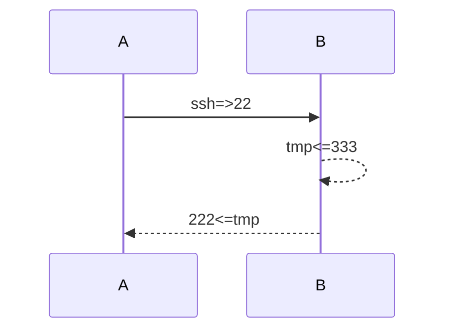
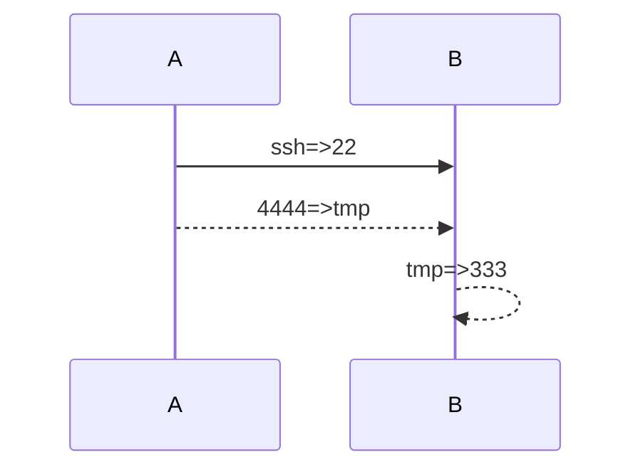
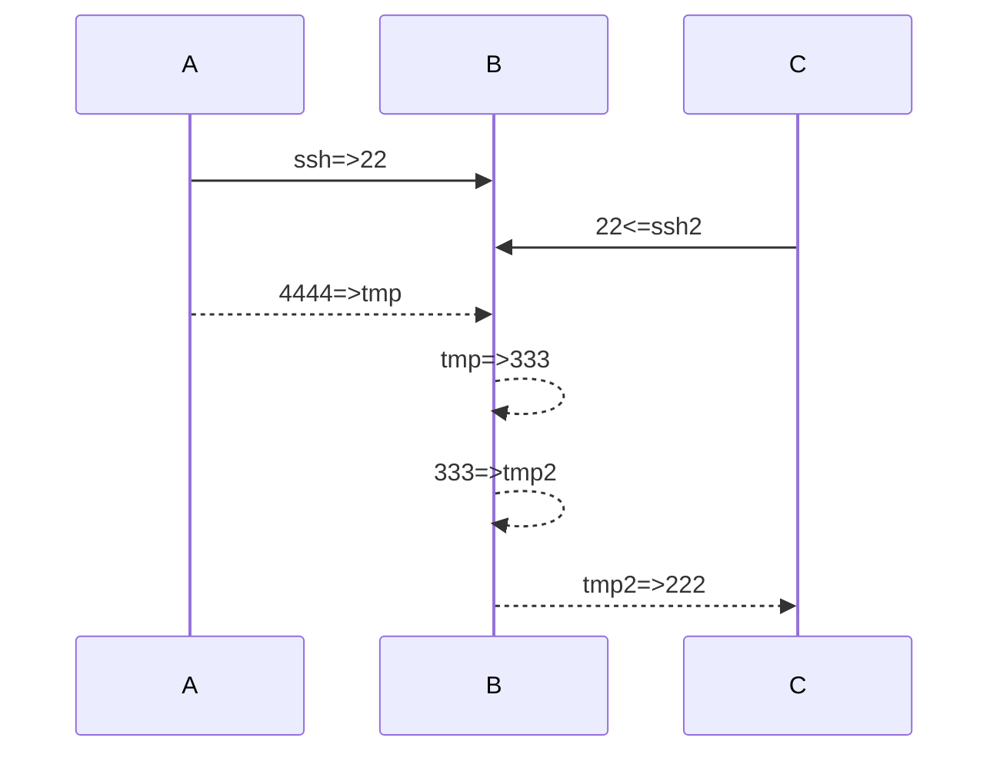

# ssh端口转发

每次ssh连接sshd，ssh会使用随机端口号连接sshd的指定端口号
## 远程转发
远程转发：
A执行`ssh -NR 333:localhost:222   -p 22 root@B`
B执行`ssh -p 333 root@B`

## 本地转发
本地转发
A执行 `ssh -NL 4444:localhost:333   -p 22 root@B`
A执行 `ssh -p 4444 root@B`

## 远程转发+本地转发
远程转发+本地转发
C执行`ssh -NR 333:localhost:222   -p 22 root@B`
A执行 `ssh -NL 4444:localhost:333   -p 22 root@B`
A执行`ssh -p 4444 root@B`

使用了以下端口
* A:ssh,A:4444
* B:22, B:tmp，B:333,B:tmp2
* C:ssh2,C:222
总共8个端口