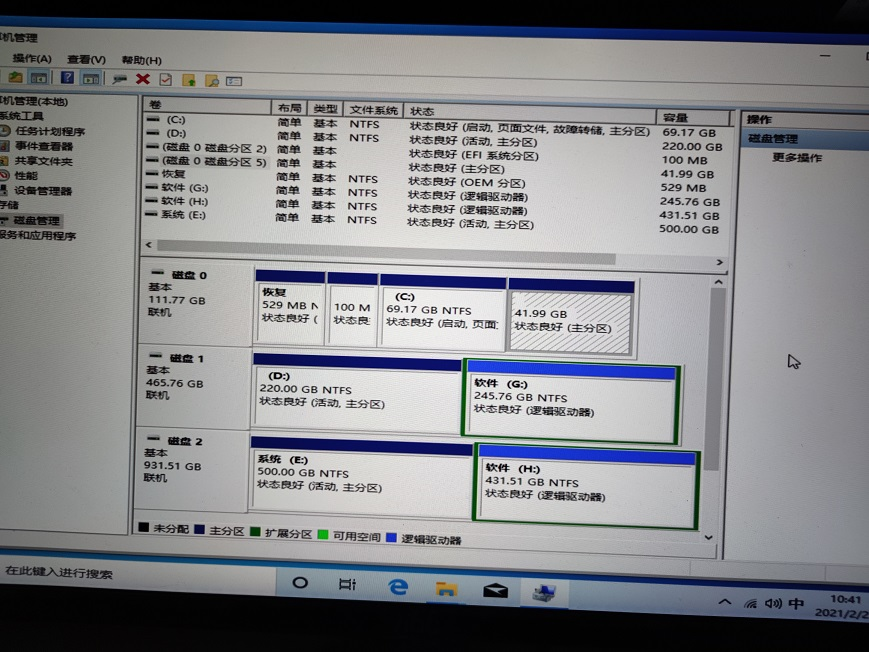
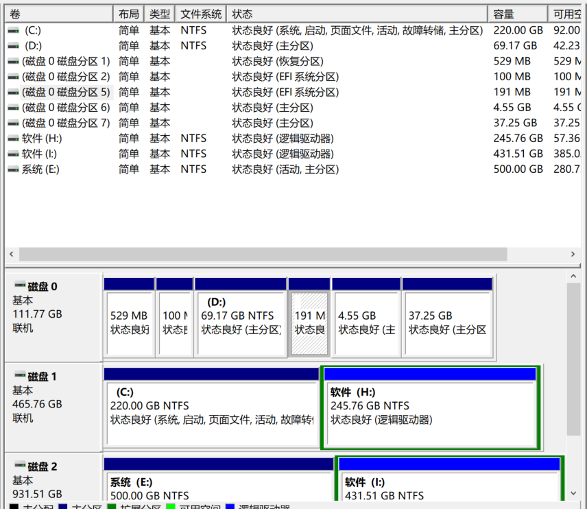
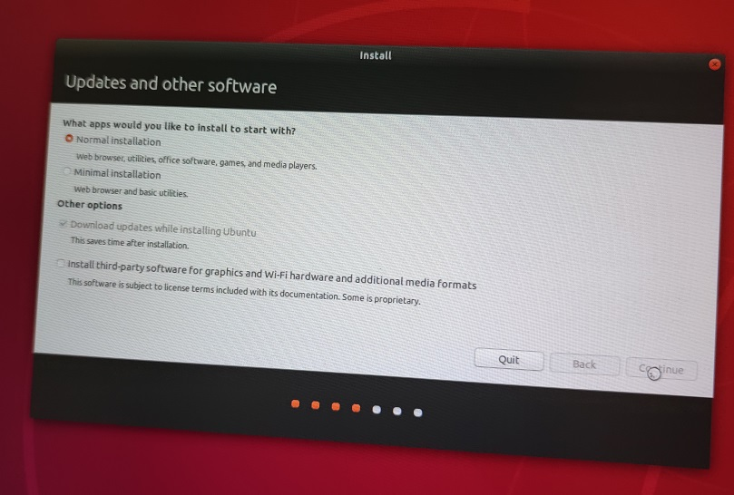
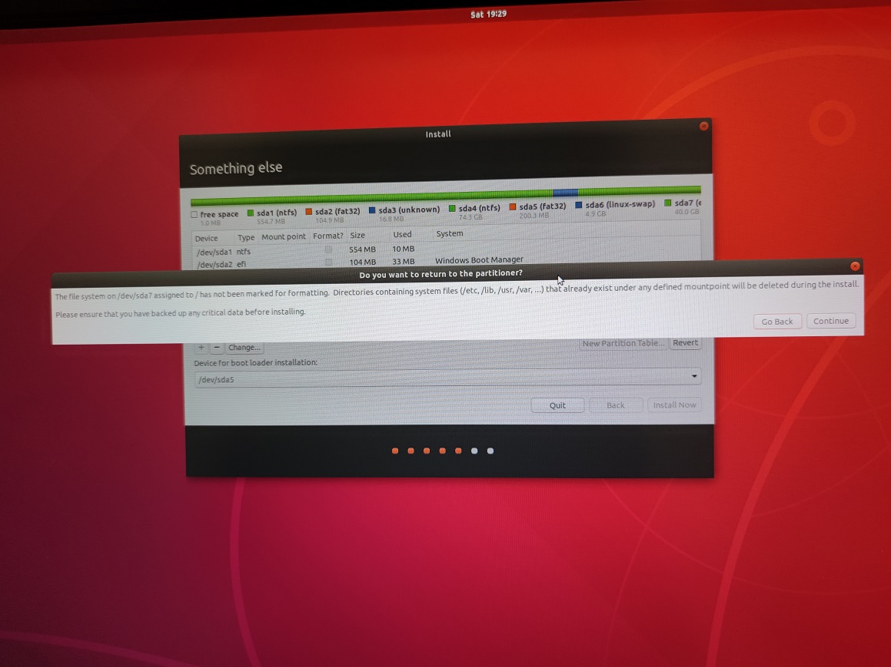

# 装系统相关问题

1. 准备u盘，制作ubuntu安装盘
2. 准备硬盘，划分分区
3. 安装ubuntu
   1. 划分分区
   2. 配置语言相关项
   3. 安装过程
   4. 重启

## 双系统相关问题
双系统相关问题：
- 选择双系统安装，
   1. 先安装windows10，后安装ubuntu
   2. 先安装ubuntu，后安装 windows10
- 选择单系统，安装虚拟机，虚拟机装子系统
   1. 选择windows，选择虚拟机装子系统
      1. 选择虚拟机vmware装 linux系统
      2. 安装 hyperV
      3. 安装ubuntu子系统
         1. 安装wsl：ubuntu子系统
         2. 安装wsl2：ubuntu子系统
   2. 选择linux
      1. 选择虚拟机安装 windows系统
      2. 选择安装wine系统

## UEFI相关问题

1. 首先查看几块硬盘
   1. 查看硬盘是GPT/MBR
   2. 查看硬盘是D固态硬盘SSD还是 机械硬盘
2. 查看BIOS是 legacy 还是UEFI

* legacy bios + MBR单硬盘
* legacy bios + MBR双硬盘
* UEFI bios + GPT单硬盘
* UEFI bios + GPT双硬盘

新主板/新CPU装新系统推荐选择 UEFI+GPT。

## ubuntu安装准备

* UEFI bios+ GPT单硬盘 安装
* UEFI bios+ GPT双硬盘（SSD固态硬盘+机械硬盘）

单硬盘安装一个系统很简单，直接格式化全盘即可。下面主要讲单硬盘安装双系统。

首先在windows下打开 磁盘管理，通过压缩卷的方法，基础空闲空间，通过删除空闲空间，把空间归还给硬盘，以便ubuntu使用这些空间。

## ubuntu安装

- 插入 usb 的ubuntu镜像。
- 在bios的配置项配置 usb作为首选启动项。
- 重启电脑，进入u盘系统，
- 选择安装ubuntu。
   - 执行磁盘分区
        - 配置根目录/ 对应路的硬盘空间
        - 配置home目录： /home 
        - 配置boot相关项，
            - legacy下是分配 /boot 对应路径和硬盘空间
            - uefi 下是分配 efi分区（大于200MB）
        - 配置交换区 /swap 对应路径和硬盘空间 （推荐4GB）
   - 配置杂项（配置语言，时区）
   - 执行安装。

/swap 指虚拟内存的交换区，一般设置为实际内存容量的两倍大小即可。

/usr:存放用户程序，一般在/usr/bin中存放发行版提供的程序，用户自行安装的程序默认安装到/usr/local/bin中具体参数：大小: 180G （视自身的存储空间而定）新分区的类型：逻辑分区新分区的位置：  空间起始位置用于： Ext4日志文件系统挂载点：/usr

/home 目录， 在通常的最佳实践中，可以把这个 home 目录作为一个单独的挂载点，挂载一个独立分区。这样做有几个好处：
- 系统分区如果损坏，幷不影响到 /home 分区所在的数据。这些数据通常非常重要，包括有你常用的软件，重要的文档以及各类软件的配置信息，反过来我们也鼓励把重要的数据存放在 /home 目录下，使得他们保存在系统分区以外的分区，避免因为系统的问题受损。
- 在重装系统，或者升级系统以后，/home 分区的数据可以得到保留，最大程度的避免了软件安装和重新配置的耗时工作。
- 在日常备份的工作中可以选择只备份 /home 分区所在的数据，避免做全盘的备份。

在 Installation type 界面选择 Something else 选项，这样你才有机会调整，保留现有分区以及分区上的数据，并将多个分区挂载到同一个系统的不同挂载点（上文所述的根目录和home目录）【推荐】。

### 分区
磁盘分区中，根据不同硬盘划分成 Sda，sdb，sdc。
同一块硬盘sda，根据不同分区，划分成 sda1， sda2，sda3等等
安装ubuntu，需要划分出分区： / 对应sda4， efi分区对应的sda5， /swap对应sda6

### windows10的磁盘管理页面

#### 单系统的磁盘管理页面

可以看到磁盘0（GPT) 有
- 分区1恢复分区 OEM分区 529MB
- 分区2 EFI系统分区 100MB
- 分区3 保留分区？ 16MB
- 分区4（C盘）  主分区，启动分区 69GB    NTFS
- 分区5 主分区 41.99GB

#### 双系统的磁盘管理页面

可以看到磁盘0（GPT) 有
- 分区1恢复分区 OEM分区 529MB
- 分区2 EFI系统分区 100MB
- 分区3 保留分区？ 16MB
- 分区4（C盘）  主分区，启动分区 69GB    NTFS
- 分区5 EFI 191MB
- 分区6 主分区 4.55GB
- 分区7 主分区 37.25GB

### 引导页面
ubuntu引导页面：

### boot

重启电脑时，需要通过在BIOS过程中点击 F11 激活 UEFI启动项，选择ubuntu页面， 可以配置 ubuntu的启动项。

注意：UEFI启动项 和 硬盘/USB 启动项不同。