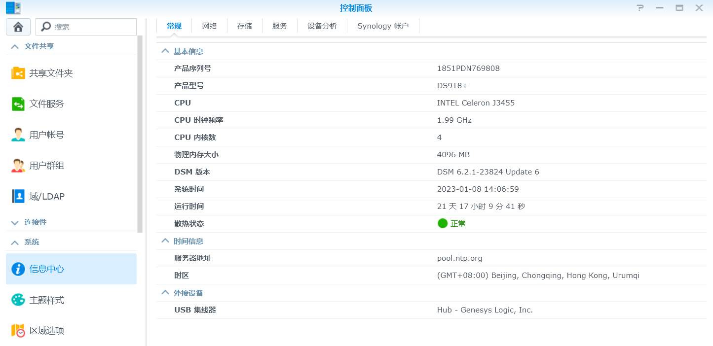
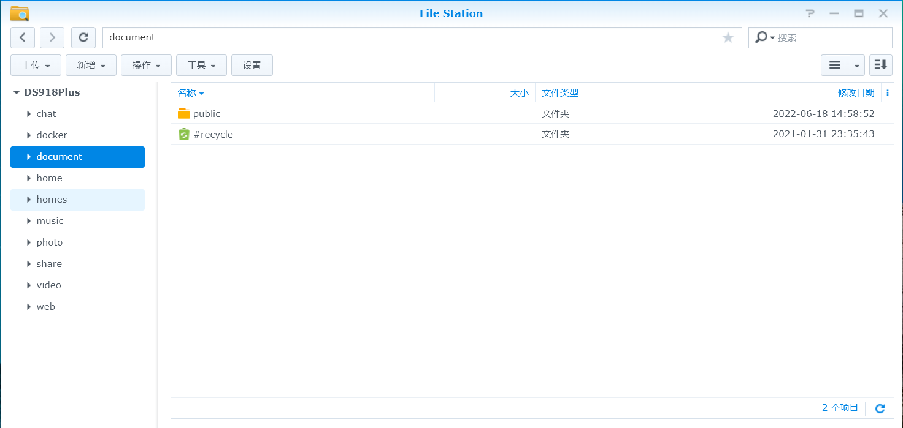

# synology

[synology](https://www.synology.cn/zh-cn)
群晖科技股份有限公司

1. 安装系统
2. 硬盘配置
3. 

## extension

### 常见app

* 服务
    * DSM网页入口   用户管理入口
    * 控制面板  基本，核心配置
    * 套件中心  安装卸载app
    * file station 文件管理（提供类似windows下explorer的功能）
    * Synology Drive 自动同步、无缝衔接云办公、文件有多版本保护（防止误删误改）、团队实时编辑表格与文档等功能。
    * photo Station
    * video station 视频管理
    * download station
    * moments  基于Drive
    * USB COPY套件
* 应用 
    * office
    * pdf

部分服务app有对应 android/ios app。
### 控制面板

#### admin/home

管理员用户默认激活home目录。

用户可以分离超级权限的管理账号（admin）和日常使用的账号。

#### 启用homes目录
为每个用户激活home目录。
控制面板, 用户,高级，激活主目录服务
#### 共享文件夹
共享文件夹的权限

#### 用户群组
### 存储空间管理员

**Q**: 群晖显示硬盘已毁损如何处理？
**A**: 
自动修复试下。成功了赶紧换硬盘
重启解决，
大概率可能只是检测到硬盘上多了几个坏扇区，其实家用的话数据不重要可以忽略这个提示，数据重要就做好备份重新格式化或者屏蔽一下坏扇区，群晖是有任何一丁点的毛病就会提示硬盘损毁的

群晖 使用 brtfs还是ext4，brtfs 。
ext4是linux的主流文件系统格式。
brtfs 是较新的文件系统格式。

群晖的文件系统是否要开启 文件快速 克隆 ?

硬盘是否要 组 raid5/raid1？还是 手动 rsync 同步硬盘内容。
- raid0
- raid1
- raid4

### file station

#### 用户读写权限配置

#### 网盘挂载

### 个人设置

### Synology Drive
下面説下Synology Drive ，他是整合原本的 File Station、Cloud Station、Synology Office的也就是說Driver類似網盤客戶端，可以在移動設備與計算機上管理所有文件，如百度雲盤，google drivemoment是Driver裏面的一個專門用來存放照片的文件夾，就好比你打開我的電腦（Drive）>D盤>照片文件夾（moment）。如google photos，百度云裏面的照片管家同時，google photos，百度云裏面的照片管家裏所上載的照片是可以在google drive與百度雲盤裏面找到的。

注意： Drive需要用Drive控制台app配置

Synology Drive 应用需要在 Drive控制台app中开启共享文件夹，团队才能使用共享文件夹。
### Synology Drive 管理控制台

### photo station
群晖下的图片管理套件叫做Photo Station, 提供基础照片管理

提供一个默认的共享目录/photo来存放相片。

也可以开启每个用户的专属目录，位于 /home/photo 目录下。

脸识别下拉菜单还能设置人脸识别功能。

共享选项可以允许将照片上传到社交网络，如油管、新浪微博及qq空间等

博客选项这个选项勾选后可以启用博客功能。

注意：只有所有者才能编辑博客，别的用户只能浏览。只有管理员才能编辑共享photo下的博客，只有个人用户才能编辑个人photo的博客。

Photo Station 会自动对照片进行转码，生成略缩图，加快浏览体验。

如何上传照片？
- 通过File Station 上传
- 通过 Synlogy Assistant
- 通过 photo Station 上传
- photo station Uploader
- DS photo 手机app

为什么DS photo上传的照片会丢失时间戳？

Photos只有面孔识别。

### moments
需要先开通Drive才能开启 Moments

个人目录： /home/Drive/Moments

共享目录：/photo/Moments

选择启用共享照片库，这个必须要Photo Station配合。

支持照片备份功能
Moments支持人脸识别，场景识别。可以 通过 ai 识别 地点和场景。

#### DS photo vs Moments
DS photo要在登录时选择是登录共享目录还是个人目录。

Moments是登录之后再选择图片源源是共享还是个人源.

moments里的共享照片库 可以查看 /photo目录，但是不能查看 ~/photo 目录。

群晖的图片管理套件新开发的是Moments套件，图片管理看着比photo要智能多了，不清楚群晖是不是准备放弃ds Photo套件了，也许是为了团队协作考虑开发的。

多用户的话怎么管理？
目前是分别ds photo上传到各自文件夹的，怎么在mom里用各自的账户分别查看各自的照片

DSM 7.0中，photo和moments两个app合并了。
### USB COPY套件
使用USB COPY 套件将NAS中的照片备份到移动存储介质。

### Video Station
Video Station: 视频管理

ds Video
### Cloud Sync
Cloud Sync: 将本地文件同步到公有云/云盘

Cloud Sync 套件将NAS中的照片同步到百度云照片
### USB COPY 套件
USB COPY 套件将NAS中的照片备份到移动存储介质
### 媒体服务器

媒体服务器: 实现视频串流
### Audio
ds Audio
### download station

下载套件ds get
### tools
存储空间分析器
Docker

### port
群晖的常用套件端口如下：

- 管理页面（DSM）：5000、5001
- Drive、Moments：6690
- photo station：58378
- 视频套件Video Station：9025 至 9040
- 下载管理套件 Ds Get：16881

## misc

是否需要经常关机？

是否要配置 停电续航设备？

moment 和driver 和 file station什么关系？

file station相当于Windows的资源管理器，可以查看nas的任何非系统文件（随便删也不会把nas搞宕机）。
driver 是file station裏面的一個資料夾/文件夾。上传到drive的文件会放在`/homes/用户名/drive`的文件夹下，
moment是driver裏面的一個資料夾/文件夾，單獨存放照片的並通過此軟體管理。

群晖的gitlab 内存 占用过高，空载都占用2GB内存。官方建议最少 2 核 8G 或者 2 核 4G+4G 的 swap。
可以考虑使用 gitea/gogs + Drone

阿里云，纯 Docker 环境跑单 Gitlab，2C 4G 就够了，CPU 峰值不过 40%，内存占用稳定 80%

 Jira 和 Jenkins。