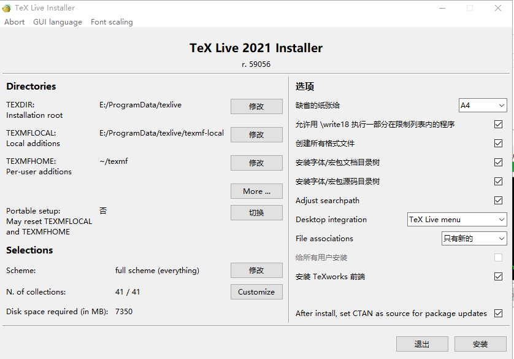

# latex


- TeX 是高德纳（Donald Ervin Knuth，做出来的排版引擎，TeX 系统生成的文件是 dvi 格式
- LaTeX 则是 L. Lamport 教授开发的基于 TeX 的排版系统。
- pdfTeX/pdfLaTeX，直接输出 pdf 格式的文档
- XeTeX/XeLaTeX 引擎需要使用 UTF-8 编码，而TeX/LaTeX仅支持ASCII编码。
- LuaTeX TeX 语言的一个完整的有扩展的实现。LuaTeX支持Unicode、系统字体和内嵌语言扩展，能直接输出PDF格式文件，也可以仍然输出 DVI 格式。


使用的发布版本
- TeXLive （3.7 G）
- [MacTeX](https://tug.org/mactex/)（4.0 G）
- [MiKTeX](https://miktex.org/)
  - windows 200MB
  - mac 50MB
- [Latexmk](https://personal.psu.edu/~jcc8/software/latexmk/) linux  
- [tinytex](https://yihui.org/tinytex/) 155M


## miktex

对于 LaTeX 的常见版本，个人推荐 MiKTeX，即最小安装版本，其 Windows 安装包约 200 多 MB，MacOS 安装包 50 多 MB。

对 Windows 用户，有 Scoop 和 Chocolatey

```
scoop install latex
choco install miktex
```

[MiKTeXmiktex.org/download](https://miktex.org/download)

### file arch
MiKTeX
- miktex/
  - bin/
    - x64/
      - latex.exe
      - pdflatex.exe
      - miktex-latex.exe
      - tex.exe
  - config/
- tex/
- tex4ht/
- biber
- fonts/
- hunspell

#### version
```

(base) H:\project\tool_misc\tools>latex --version
MiKTeX-pdfTeX 4.10 (MiKTeX 22.3)
© 1982 D. E. Knuth, © 1996-2021 Hàn Thế Thành
TeX is a trademark of the American Mathematical Society.
using bzip2 version 1.0.8, 13-Jul-2019
compiled with curl version 7.72.0; using libcurl/7.72.0 Schannel
compiled with expat version 2.2.10; using expat_2.2.10
compiled with jpeg version 9.4
compiled with liblzma version 50020052; using 50020052
compiled with libpng version 1.6.37; using 1.6.37
compiled with libressl version LibreSSL 3.1.4; using LibreSSL 3.1.4
compiled with MiKTeX Application Framework version 4.4; using 4.4
compiled with MiKTeX Core version 4.12; using 4.12
compiled with MiKTeX Archive Extractor version 4.0; using 4.0
compiled with MiKTeX Package Manager version 4.7; using 4.7
compiled with uriparser version 0.9.4
compiled with xpdf version 4.02
compiled with zlib version 1.2.11; using 1.2.11
latex: major issue: So far, no MiKTeX administrator has checked for updates.
```
## TexLive

该文件




TeXLive （3.7 G）和 轻便了一个量级。其官方下载地址如下。

## MacTeX

MacTeX（4.0 G）


