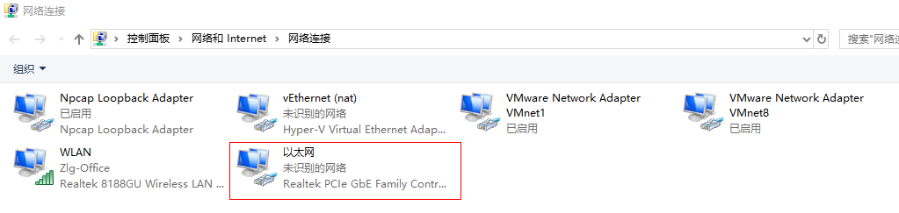
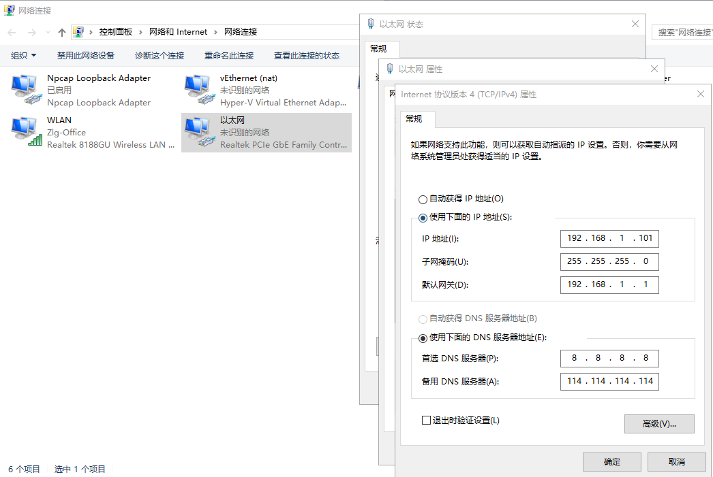
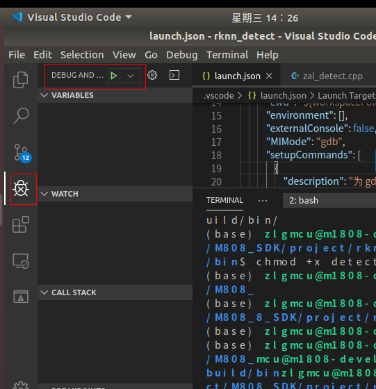
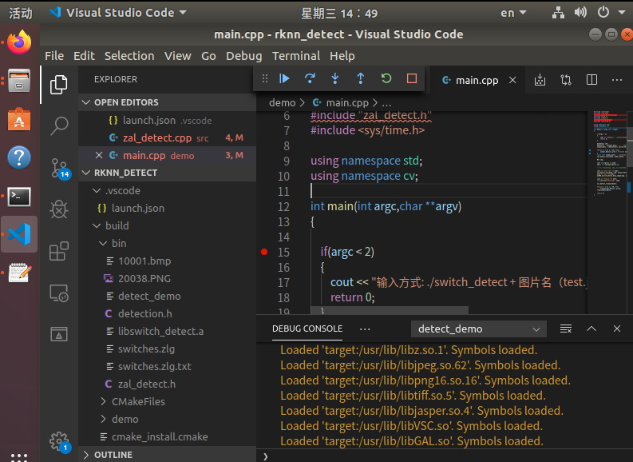

# 在vscode上通过gdb远程调试arm开发板


需要以下流程：
1. pc机上配备交叉编译工具
   1. 编译 gcc和调试工具gdb，
   2. 交叉编译生成编译gdbserver
2. arm 开发板上配备 gdbserver
   1. 准备gdbserver
   2. pc机配置网络ip，与arm开发板的ip一致
   3. arm开发板和pc之间用ping测试能否通信
3. 编译程序
   1. cmake编译时配置 debug选项。
   2. 执行编译，生成 exe文件
4. 运行gdbserver服务
   1. 把pc上的exe文件通过ssh复制到 arm开发板上
   2. 通过ssh，在arm开发板上 运行 gdbserver，指定 运行exe文件和服务端口号
5. 在vscode上配置debug配置
   1. 指定本地debug的exe文件
   2. 指定gdbserver的ip和端口
6. 执行gdb调试
   1. 点击F5开始调试

## pc上配置gcc和调试工具gdb
知道gcc和gdb路径，确保可以调用即可。

**注意**: gdb是`aarch64-linux-gnu-gdb`

gdbserver运行在开发板上， 所以需要交叉编译生成gdbserver。

## 开发板上配置

### 配备gdbserver
复制gdbserver到开发板上
### IP配置
gdbserver 支持串口/网口和pc相连，这里推荐网线连接。直接把pc的网口和开发板的网口用网线连接即可。

通过执行 `ip addr` 可以查看ip地址：
```
[root@M1808 bin]# ip addr
1: lo: <LOOPBACK,UP,LOWER_UP> mtu 65536 qdisc noqueue state UNKNOWN group default qlen 1
    link/loopback 00:00:00:00:00:00 brd 00:00:00:00:00:00
    inet 127.0.0.1/8 scope host lo
       valid_lft forever preferred_lft forever
    inet6 ::1/128 scope host
       valid_lft forever preferred_lft forever
2: eth0: <BROADCAST,MULTICAST,UP,LOWER_UP> mtu 1500 qdisc pfifo_fast state UP group default qlen 1000
    link/ether 00:14:97:30:72:db brd ff:ff:ff:ff:ff:ff
    inet 192.168.1.136/24 brd 192.168.1.255 scope global eth0
       valid_lft forever preferred_lft forever
    inet6 fe80::214:97ff:fe30:72db/64 scope link
       valid_lft forever preferred_lft forever
```
可以看到ip地址是 `192.168.1.136`

在开发板上，可以通过 `ifconfig eth0 X.X.X.X netmask 255.255.255.0` 命令修改ip地址为目标地址 X.X.X.X 。


开发板上默认的ip地址是 `192.168.1.136`, 这里需要把pc的IP地址修改的一致，确认都在 `192.168.1.1/24` 网关下。
**注意**： pc上有多块网卡，有多块虚拟的网络适配器，需要正确找到以太网对应那个网络适配器，只有这个的网卡和网线相连。



改成 ip地址是 `192.168.1.101`, gateway `192.168.1.1`  netmask `255.255.255.0`


### ping测试

在pc机上执行 即可
```
F:\tmp>ping 192.168.1.136

正在 Ping 192.168.1.136 具有 32 字节的数据:
来自 192.168.1.136 的回复: 字节=32 时间<1ms TTL=64
来自 192.168.1.136 的回复: 字节=32 时间<1ms TTL=64
来自 192.168.1.136 的回复: 字节=32 时间<1ms TTL=64
来自 192.168.1.136 的回复: 字节=32 时间<1ms TTL=64

192.168.1.136 的 Ping 统计信息:
    数据包: 已发送 = 4，已接收 = 4，丢失 = 0 (0% 丢失)，
往返行程的估计时间(以毫秒为单位):
    最短 = 0ms，最长 = 0ms，平均 = 0ms
```


或者在 开发板上执行`ping 192.168.1.101`


**注意**，如果无法联通，可能需要在M1808开发板上执行语句 `io -4 -w 0xfe000900 0xffff050a`


## debug编译
在CMakeLists.txt下加入
```cmake
SET(CMAKE_BUILD_TYPE "Debug") 
SET(CMAKE_CXX_FLAGS_DEBUG "$ENV{CXXFLAGS} -O0 -Wall -g -ggdb")
SET(CMAKE_CXX_FLAGS_RELEASE "$ENV{CXXFLAGS} -O3 -Wall")
```
然后执行编译生成调试程序

## 运行gdbserver服务
可以通过ssh连接开发板, 把程序复制到开发板上，启动 gdbserver程序:

```
cd /root/project
chmod +x detect_demo
gdbserver :8888 detect_demo 10001.png

```

## 配置vscode

首先打开vscode，点开应用商店安装插件
* C/C++ 插件
* remote development 插件


在项目目录下新建`.vscode`目录，新建`launch.json`
1. name：调试的项目名
2. program：需要调试的应用程序可执行文件路径。
3. cwd：需要调试的应用程序源码路径。
4. miDebuggerPath：此项需要手动添加，用于指定所使用的交叉编译器 gdb路径。
5. miDebuggerServerAddress：此项需要手动添加，远程 gdbserver服务器地址，也就是开发板地址

``` json
{
    // Use IntelliSense to learn about possible attributes.
    // Hover to view descriptions of existing attributes.
    // For more information, visit: https://go.microsoft.com/fwlink/?linkid=830387
    "version": "0.2.0",
    "configurations": [
        {
            "name": "detect_demo",
            "type": "cppdbg",
            "request": "launch",
            "program": "${workspaceFolder}/build/bin/detect_demo",
            "args": ["10001.bmp"],
            "stopAtEntry": false,
            "cwd": "${workspaceFolder}",
            "environment": [],
            "externalConsole": false,
            "MIMode": "gdb",
            "setupCommands": [
                {
                    "description": "为 gdb 启用整齐打印",
                    "text": "-enable-pretty-printing",
                    "ignoreFailures": true
                }
            ],
            "miDebuggerPath":"/opt/zlg/m1808-sdk-v1.3.1-ga/host/bin/aarch64-linux-gnu-gdb",
            "miDebuggerServerAddress":"192.168.1.136:8888"
        }
    ]
}
```
## 执行debug

点击 调试按钮，开始调试即可。


调试过程：
