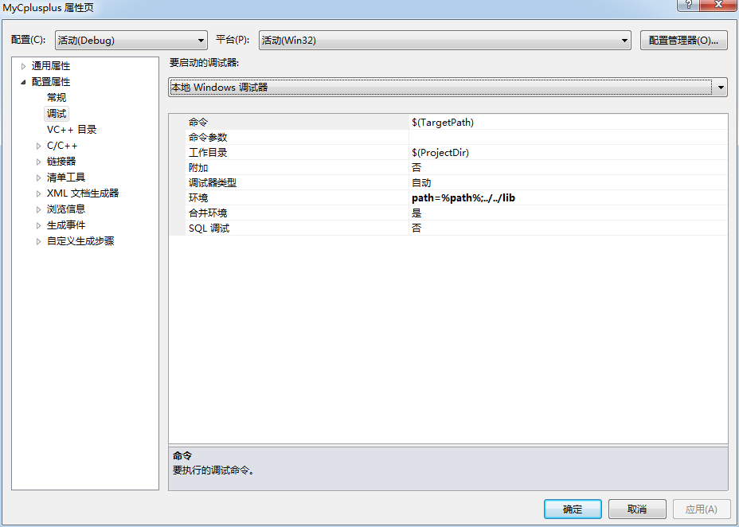

# 正确设置VS调试环境，调试时报错-找不到.dll文件解决办法

## 1. 什么是dll文件

DLL(Dynamic Link Library)文件，中文叫动态库文件，是程序在**运行**时所需要调用的库，那么静态库lib文件就是在程序编译时所需要调用的库。

## 2. 正确配置dll文件

程序在执行时，会从以下路径中搜索dll。

- 当前工作目录
- 可执行文件所在的目录
- 环境变量PATH中

### 可选方法

- 把dll文件的路径添加到系统的环境变量 PATH 中：
-  直接把所有 dll 拷贝到 Visual Studio 工程目录下，或是拷贝到生成可执行文件的文件夹（默认情况下是 Debug 或 Release 目录）下，通常我们在程序发布时要这样打包，但是在调试时不用这么做。
-  在调试程序时，切换当前工作目录到 dll 目录：在 项目-属性- 配置属性 -调试-工作目录，改成 dll 所在目录，这样当在调试程序时，Visual Studio 会把当前工作目录切换到这个目录下。但是这样做，工作目录完全就变了，这样的话，原来的工作目录的一些配置文件都找不到了，所以非常不建议这么做。

### VS中最好的方法：修改调试的环境变量

显然，最适合的思路是修改环境变量PATH，但直接修改PATH容易污染及环境变量，最好的方法是临时修改环境变量，尽在调试时生效。

设置方法：vs工程属性–>配置属性–>调试–>环境，

例如，我们要引用../lib/目录里面的dll，那么我们可以设置为：`path=%path%;../../lib`
