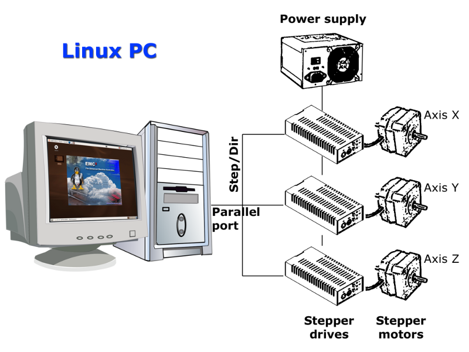

# LinuxCNC的初步了解

初步认识LinuxCNC
原名EMC2（Enhanddced Machine Control 2）增强型运动控制器，主要由以下几个部分组成

### EMC模块

1. 运动控制器 EMC/MOT
2. I/O控制器 EMC/IO
3. 任务调度控制器 EMC/TASK
4. 用户界面 UI

以上4个模块中只有EMCMOT是实时控制模块，其他三个都是非实时控制模块

### 模块之间的通信
模块分为实时模块和非实时模块，其中实时模块只有运动控制系统EMCMOT，其余的EMCIO，EMCTASK UI都是非实时模块，因此通信主要集中在非实时模块之间，实时和非实时模块之间。
非实时模块间的通信利用NML(Neutral Massaging Language)通道进行通信
实时与非实时模块之间利用共享存储器或者实时队列（RT-Linux FIFO）机制来进行通信
此外还添加硬件抽象层HAL(Hardware Abstraction Layer)。用于提供硬件驱动模块和功能模块的运行环境

### 硬件抽象层 （HAL）
正确的链接要求：1HAL模块之间必须通过引脚来链接。2数据类型必须一致（浮点型，有/无符号整数型，布尔型）
此外LinuxCNC还提供两个开发定制HAl模块的工具：Comp和Classicaddr。前者主要用于编译用户自己写的HAL或者安装到LinuxCNC中。后者主要是基于梯形图编程的HAL模块开发工具，还提供Python语言的支持包，可用于非实时模块的开发

### 运动控制模块EMC/MOT

运动控制模块EMC/MOT
1、实时并且循环地执行轨迹规划
2、正向反向运动学计算并将结果输出到电机控制子系统中，相应的电机执行。
控制过程主要分为：1位置采样，2计算下个轨迹点，3轨迹点间的插值计算
控制模式主要分为：单轴手动模式，程控模式。

### 任务调度模块EMC/TASK
对任务命令进行处理并对G代码进行解释
监视下属模块的状态（EMCMOT和EMCIO）并管理
接受操作者的命令，并解释为NML消息，并依据工作状态把NML消息分派到运动控制器，I/O控制器或者任务调度模块中去

### UI

