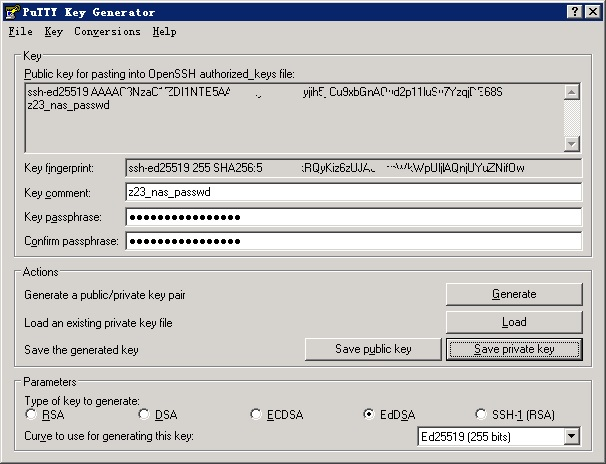

# putty

[https://putty.org/](https://putty.org/)

> PuTTY is an SSH and telnet client, developed originally by Simon Tatham for the Windows platform. PuTTY is open source software that is available with source code and is developed and supported by a group of volunteers.

## download

[https://www.chiark.greenend.org.uk/~sgtatham/putty/latest.html](https://www.chiark.greenend.org.uk/~sgtatham/putty/latest.html)

- putty.exe (the SSH and Telnet client itself)
- pscp.exe (an SCP client, i.e. command-line secure file copy)
- psftp.exe (an SFTP client, i.e. general file transfer sessions much like FTP)
- puttytel.exe (a Telnet-only client)
- plink.exe (a command-line interface to the PuTTY back ends)
- pageant.exe (an SSH authentication agent for PuTTY, PSCP, PSFTP, and Plink)
- puttygen.exe (a RSA and DSA key generation utility)
- pterm.exe (a PuTTY-style wrapper for Windows command prompts)
- putty.zip (a .ZIP archive of all the above except PuTTYtel and pterm)

### putty.exe

gui工具，
### puttygen

gui工具，可以生成公钥私钥，转换成格式。





#### ppk
可以把openssh密钥文件，转换成ppk格式的文件：

```
PuTTY-User-Key-File-3: ssh-ed25519
Encryption: aes256-cbc
Comment: z23_nas_passwd
Public-Lines: 2
AAAAC3NzaC1lZDI1NTE5AYybGnAQyd2pBAAIMyfW5B0jih5yCu9x11luSy7YzqjD
E68S
Key-Derivation: Argon2id
Argon2-Memory: 8192
Argon2-Passes: 8
Argon2-Parallelism: 1
Argon2-Salt: ef7a61e2edb1f6cf52714925dd9112fe
Private-Lines: 1
sAWWw9ac7pVnGYMVdEv3soFE1QebLKzWbN5h1LzNEaCXf65FYANwKebDlaGsD+Zd
Private-MAC: e48dfc08765772915f67e846551c17c53775a07f85fd7c470ad2c6e0252d0c4d
```
