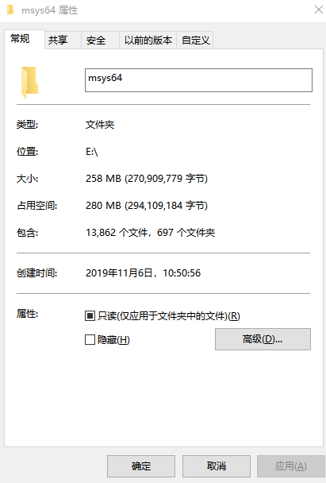

# msys2

[TOC]

[https://www.msys2.org/](https://www.msys2.org/)

## install
windows系统下下载msys2-x86_64-20180531.exe（80MB），双击选择安装路径。

安装后258MB




## msys2


### 环境辨析
以下概念容易混淆：mingw，mingw-w64， msys,msys2,cygwin.

**mingw**包含C运行库和windows的头文件，以及编译链工具，可以生成windows的32位可执行文件。通过提供对等于	windowsSDK的头文件和库文件，可以开发原生的windows应用。
- **Mingw-w64**是Mingw衍生而来，可以生成32位和64位的windows可执行文件。
- **msys**是包含Mingw的集成环境，提供了命令行工具。
- **msys2**是集成环境，从cygwin中fork而来，实现了仿gnu编译环境，提供了pacman作为包管理工具。
- **cygwin**是中间层，在window下模拟实现了unix的类函数。linux下写的代码（支持POSIX API)可以无需修改，移植到windows下环境。 

cygwin和MinGW主要核心区别在于：MinGW只支持C/C++标准库，cygwin还支持POSIX API， MinGW生成windows的原生程序，cygwin生成程序非原生，cygwin生成程的运行速度较mingw生成程序的运行速度慢。

POSIX API 包括pthreads的线程库。


**Q**: 三种环境有何区别？

**A**:
mingw64 使用了原生windows，性能较高；msys使用了cygwin，所以性能低下。mingw32已经废弃了，更推荐使用mingw64。


**Q**: clang64，ucrt64。clang32这三种环境和mingw64有何区别？

**A**:
新版本又添加了 clang64，ucrt64。clang32， clangarm32这两个环境默认不提供。


mingw64 与 ucrt64 都是用 gcc 编译器编译的 Windows 64 位程序，只不过它们链接到的 crt（C runtime）不同， mingw64 是链接到了 msvcrt ，而 ucrt64 则是链接到了 Windows 上新的 ucrt 上。

而 clang64 很好理解，就是用 clang 而非 gcc 来编译各种库。另外它也是链接到了 ucrt 而非 msvcrt。

三者是共同点是，它们都需要 mingw-w64 环境来进行编译。

对于新版本，更加推荐使用ucrt64。
### file

msys2 的本目录结构

总共有7套环境。


- msys2 默认环境，使用cygwin的底层库
    - /usr
    - /var
    - ...
- mingw32 
- mingw64
- clang64
- clang32 
- clangarm64
- ucrt64

MSYS2 官方新闻：2022.10.29，将默认环境由 MINGW64 更换为 UCRT64


``` 
mingw32/          
mingw64/ 
clang64/    
clang32/     
clangarm64/            
ucrt64/ 

etc/                    
bin/                
home/ 
opt/          
proc/          
installerResources/  
tmp/           
usr/    
var/        
dev/

InstallationLog.txt
autorebase.bat   
installer.dat   
network.xml       
components.xml  

clang32.exe
clang32.ico   
clang32.ini  

clangarm64.exe   
clangarm64.ini
clangarm64.ico

clang64.exe
clang64.ini
clang64.ico 

msys2.ini
msys2_shell.cmd
msys2.exe 
msys2.ico  

mingw32.ini  
mingw32.exe 
mingw32.ico  

mingw64.exe
mingw64.ini
mingw64.ico 

ucrt64.ico
ucrt64.exe
ucrt64.ini

uninstall.ini
uninstall.dat   
uninstall.exe
```


mingw32 &mingw64 为空文件夹

home ,usr ,var ,tmp ,etc ,dev #  msys根目录，可以快速直达


autorebase.bat 可以在cmd中快速实现msys环境。

maintenancetool.exe 该文件已经废弃删除。

#### 环境切换
msys2的软件版本分为mingw32,mingw64和msys三种环境。

以上三种环境可以通过一个脚本分别实现切换

``` bash
C:\msys64\msys2_shell.cmd -msys
C:\msys64\msys2_shell.cmd -mingw64
C:\msys64\msys2_shell.cmd -mingw32
```

msys2_shell.cmd 支持三种终端界面： 默认界面，mintty界面，conemu界面。

## tools

以下是常用工具，包括pacman，zsh，gcc。

#### pacman

```bash
pacman -Sy  # update
pacman -Syu # update all
pacman -Ss xxx # search xxx
pacman -Sy xxx # install xxx
pacman -Sl # 查看软件清单
pacman -Sl |grep "gcc"

pacman -S make yasm diffutils pkg-config
```

```
admin@DESKTOP-CTAGE42 MSYS ~
$ pacman -S make yasm diffutils pkg-config
警告：make-4.2.1-1 已经为最新 -- 重新安装
正在解决依赖关系...
正在查找软件包冲突...

软件包 (4) diffutils-3.6-1  make-4.2.1-1  pkg-config-0.29.2-1  yasm-1.3.0-2

下载大小:   0.81 MiB
全部安装大小：  4.87 MiB
净更新大小：  3.65 MiB

:: 进行安装吗？ [Y/n] y
:: 正在获取软件包......
 yasm-1.3.0-2-x86_64      308.7 KiB   267K/s 00:01 [#####################] 100%
 diffutils-3.6-1-x86_64   329.9 KiB   153K/s 00:02 [#####################] 100%
 pkg-config-0.29.2-1...   185.7 KiB   226K/s 00:01 [#####################] 100%
(4/4) 正在检查密钥环里的密钥                       [#####################] 100%
(4/4) 正在检查软件包完整性                         [#####################] 100%
(4/4) 正在加载软件包文件                           [#####################] 100%
(4/4) 正在检查文件冲突                             [#####################] 100%
(4/4) 正在检查可用硬盘空间                         [#####################] 100%
:: 正在处理软件包的变化...
(1/4) 正在重新安装 make                            [#####################] 100%
(2/4) 正在安装 yasm                                [#####################] 100%
(3/4) 正在安装 diffutils                           [#####################] 100%
(4/4) 正在安装 pkg-config                          [#####################] 100%
```

pacman配置颜色
略
