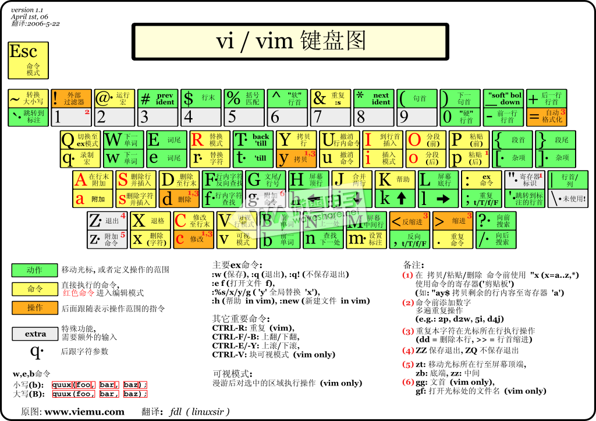

# vim
### 底行操作
#### 文件操作
``` bash
:w # 保存文件
:wq # 保存文件并退出
:q! # 强制退出不保存
:e abc.txt # 打开文件abc.txt
:e! # 手动重加载文件
:f abc.txt # 同上
:new abc.txt # 新建abc.txt
:w [filename] # 另存为filename
:r [filename] # 尾追加文件内容
:n1,n2 w [filename] # 部分另存为filename
```
#### 多文件操作

``` bash 
vim file1 file2 ... filen # 便可以打开所有想要打开的文件
vi -o file1 file2 file3... # .用分割屏幕窗口方式同时打开多个文件
:open file #可以再打开一个文件，并且此时vim里会显示出file文件的内容。
:files #查看当前打开了哪些文件 

# 当前窗格切换
Ctrl+6 #切换下一个文件
:bn # 切换下一个文件
:bp # 切换上一个文件
:bd # 
:b2 # 
:n 切换到下一个文件
:N 切换到上一个文件

## 新建多个窗格
:split # 水平切割显示多个文件
:vsplit # 垂直切割显示多个文件
:3split # 切割三行显示文件，
# 多个窗格间切换的方法
Ctrl+w+up #  换到前／下／上／后一个窗格
Ctrl+w+h/j/k/l # 同上
Ctrl+w+t/b # 历史记录前进后退窗格
Ctrl+w+H/J/K/L # 交换窗格位置
Ctrl+ww # 依次向后切换到下一个窗格中
ctrl+w +/- # 放缩窗格，难以控制
ctrl+w+_ # 尽可能放大窗格
:qall # 关闭所有窗格

```
#### 文件夹打开

``` bash
#vim命令模式下
:e
:Explore #当前窗口下打开
:Vexplore #竖直分割窗口打开
:Sexplore #水平分割窗口打开
i # 切换文件视图
```


#### 会话管理
:mksession Foo.vim
:source Foo.vim

#### 寄存器

1. 未命名寄存器
（unnamed register） `""` —— vim使用的默认寄存器，文本来源命令：d/c/s/x/y
2. GUI选择寄存器 `"*` `"+` `"~` —— vim缓存在GUI中选择的文本,非常重要，外部程序交互靠它。+对应剪切板。×对应复制板
3. 10个数字命名寄存器 `"0 `- `"9` —— vim缓存yank和delete行操作命令（y，d，x，c）产生的文本
4. 1个非行删除内容缓存寄存器 "- —— vim缓存delete操作在非行上时产生的文本
5.  26个字母命名寄存器 "a - "z / "A - "Z —— 完全由用户指定内容的寄存器
6.  4个只读寄存器 ". "% "# ":  
7.   表达式寄存器 "= —— 使用VIM强大的表达式功能（从来没用过，一点不懂）
8. 黑洞寄存器 "_ —— 类似Linux中的/dev/null文件，只进不出，可用来滤掉影响默认寄存器的内容
9. 最后搜索模式寄存器 "/ —— 缓存在vim中使用过的最后的搜索内容

寄存器操作可以搭配 复制剪切黏贴操作，
``` bash  
   "*y # 复制到系统剪切板
   "+Y # 复制当前行到系统剪切板
   "+nY #  复制当前行往下 n 行到系统剪切板
  :dis  # 显示寄存器
  :reg # 显示寄存器
  "*p  # 使用系统剪切板黏贴
  "+p  # 使用系统剪切板黏贴（然后清除"*寄存器）
```

##### 复制

更好的做法是，在vim中使用 "*y 使用进行复制，然后在应用程序中用ctrl+v粘贴。
从应用程序到vim则在应用程序中使用ctrl+c复制，在vim中使用shift+insert粘贴。
可以在vimrc中加入`
set clipboard=unnamed` 来使y和"+y等效。


#### misc
``` bash
:set nu	# 显示行号，设定之后，会在每一行的前缀显示该行的行号
:set nonu	# 为取消行号！
:h # 打印帮助文档
:syntax on # 语法高亮显示
:set tabstop=4
:set softtabstop=4
:set autoindent
:version
:highlight Normal ctermbg=1 guibg=red
```
#### shell调用
``` bash
:! command	# 暂时离开 vi 到指令行模式下执行 command 的显示结果！例如
#『:! ls /home』即可在 vi 当中察看 /home 底下以 ls 输出的档案信息！
:! cmd # 交互式显示cmd
```

**Q**: 如何在vim和shell之间重定向操作?
**A**: 操作如下：
希望把 .cc 后缀更名为 .cpp，可以在Vim中通过` :read !ls *.cc `命令将shell命令` ls *.cc`的输出重定向到Vim缓冲区中，再使用Vim替换命令` :%s/\(.*\).cc/mv & \1.cpp `生成shell重命名命令mv，最后使用 `:write !sh` 执行当前缓存区中的每一行，从而达到对所有 .cc 文件重命名为 .cpp 的目的。

### misc
vimdiff
gvimdiff
gvim

viewdiff




