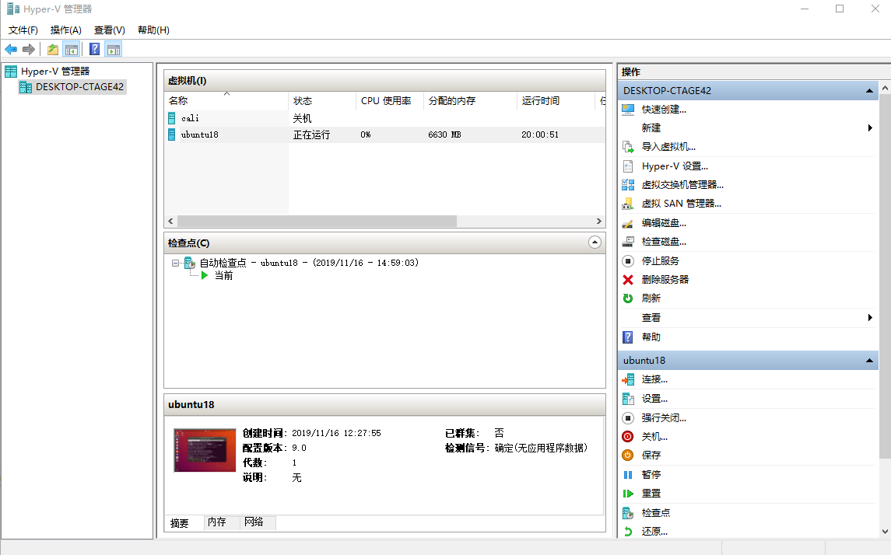

# hyper-V


要求CPU支持虚拟化，所以没有虚拟化的还是用vmware、virtualbox吧
开启服务：

打开控制面板，选择服务，打开“启用或关闭windows功能”，勾选hyper-V，重启即可。

程序位于`C:\Windows\System32\virtmgmt.msc`

默认调用方法：C:\ProgramData\Microsoft\Windows\Start Menu\Programs\Administrative Tools\Hyper-V Manager.lnk

`%windir%\System32\mmc.exe "%windir%\System32\virtmgmt.msc`




## 新建虚拟机

点击右边快速创建

## 网络连接
对于xp系统，需要安装vmguest.iso


**Q**： 如何固定虚拟网卡的ip
**A**： 需要新建一块固定ip的虚拟网卡。
VMSwitcherInner 设置
1. hyper管理器中，新建 VMSwitcherInner，选择内部（内部）.注意，千万避免启用VLan ID。
2. VMSwitcherInner设置固定IP地址：192.168.X.1 ,(X 可以自己定)
3. 虚拟机操作系统中设置使用VMSwitcherInner虚拟网卡。
4. 开启虚拟机系统，网络设置使用固定ip地址，192.168.X.Y ,(Y>1),使用子网掩码255.255.255.0
5. 从主机测试 `ping 192.168.X.Y`，能ping通说明成功连接内网。

如果能PING通路由器而PING不通www.baidu.com 则说明外网没连通。
如果不能PING通www.baidu.com，却可以通过浏览器访问外网，则可能是DNS没正确设置。
如果希望虚拟网卡可以访问外网，需要设置
1. 可以访问外网的网卡设置共享，允许虚拟网卡可以访问外网
2. 虚拟机系统中网络设置，使用固定DNS，填写外部网卡的DNS
3. 此时可以从主机测试 `ping www.baidu.com`，能ping通说明成功连接外网。


**Q**： 以上的网卡设置共享，经常会在重启之后失效，
**A**：需要重新设置?

**Q**： 如何固定虚拟网卡的ip,使用外部链接的方式？
**A**：?


## 文件共享
**Q**: 怎么实现Hyper-V中的虚拟机与主机的文件共享?
**A**: 
1. 使用mstsc远程登陆
2. 文件夹共享？

xp系统的版本过低，不支持文件复制，需要使用mstsc才能实现文件复制


## commands
``` bash
Start-VM -VMName "虚拟机的名字1","虚拟机的名字2","虚拟机的名字n" # 管理员权限的powershell 中可以直接启动虚拟机，

"C:\Windows\System32\vmconnect.exe" DESKTOP-PGE4321 vm10
"C:\Program Files\Hyper-V\6.3\vmconnect6.3.exe" DESKTOP-PGE4321 vm3

```


```
H:\project\record\todo>where vm*.exe
C:\Windows\System32\vmcompute.exe
C:\Windows\System32\vmconnect.exe
C:\Windows\System32\vmms.exe
C:\Windows\System32\vmplatformca.exe
C:\Windows\System32\vmsp.exe
C:\Windows\System32\vmwp.exe
```